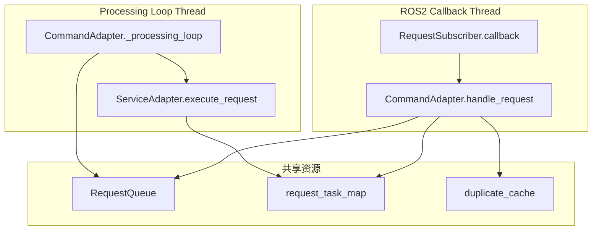

# bot_cmd_interface 架构设计文档

**功能包名称**: bot_cmd_interface  
**版本**: v0.3.0  
**创建日期**: 2026-01-06  
**更新日期**: 2026-01-07  
**状态**: 🟢 生产就绪 (Production Ready)

---

## 1. 设计目标与核心理念

### 1.1 核心设计目标

为LeKiwi机器人提供一个**统一的、松耦合的、基于请求ID管理的命令接口层**，实现：

1. **统一协议标准** - 定义基于ROS2 Topic的异步请求/响应协议
2. **请求ID驱动** - 以请求ID为核心的生命周期管理，不区分终端来源
3. **松耦合架构** - 终端与后端通过标准协议交互，互不依赖
4. **简化消息格式** - 使用JSON统一承载各种命令参数，减少ROS消息类型定义

### 1.2 设计理念

```
核心理念：统一协议 + 请求ID中心 + JSON封装

[任意终端]
   │
   ├─ 生成请求ID
   ├─ 构造JSON请求
   └─ 发布到 /cmd/request
         ↓
   [CommandAdapter]
   ├─ 解析JSON
   ├─ 队列管理（基于请求ID）
   ├─ 去重（5秒内相同内容）
   ├─ 调用后端服务
   └─ 发布响应到 /cmd/response
         ↓
   [任意终端]
   └─ 订阅 /cmd/response，根据请求ID过滤消息

关键点：
- 终端不需要知道后端服务细节
- CommandAdapter不需要知道终端类型
- 通过请求ID建立请求-响应关联
```

### 1.2.1 编码规范

**注释规范**:
- **中英文双语注释** - 所有代码注释采用中文描述+英文对照
- 格式：`# 中文说明 / English description`
- 目的：便于国际化协作，同时保持中文可读性

**日志规范**:
- **统一英文输出** - 所有ROS2日志消息使用英文
- 格式：`self.get_logger().info("Request queued successfully")`
- 原因：日志用于调试和监控，英文便于工具解析和国际化

**示例**:
```python
class CommandAdapter:
    def __init__(self):
        # 初始化请求队列 / Initialize request queue
        self.request_queue = RequestQueue(max_size=100)
        
        # 启动处理循环 / Start processing loop
        self.processing_thread = threading.Thread(
            target=self._processing_loop,
            daemon=True
        )
        self.processing_thread.start()
        
        self.get_logger().info("CommandAdapter initialized successfully")  # 日志英文
```

### 1.3 版本管理说明

**文档版本 vs SDK版本**:
- **文档版本**: 设计文档的迭代版本（当前v0.2.0）/ Design document iteration version (current v0.2.0)
- **SDK版本**: bot_cmd_interface包的发布版本（当前1.0.0）/ bot_cmd_interface package release version (current 1.0.0)
- **关系**: 文档版本可能快于SDK版本（设计阶段），也可能落后（代码已实现但文档未更新）/ Relationship: Document version may be ahead of SDK (design phase) or behind (code implemented but docs not updated)

**版本号规范 / Version Number Convention**:
- **文档版本 / Document version**: v{major}.{minor}.{patch}
  - major: 架构重大变更 / Major architecture changes
  - minor: 功能增减、接口调整 / Feature additions/removals, interface adjustments
  - patch: 修正错误、补充说明 / Bug fixes, documentation enhancements
  
- **SDK版本 / SDK version**: 遵循语义化版本规范（Semantic Versioning）/ Follows Semantic Versioning
  - 1.0.0: 初始稳定版本 / Initial stable release
  - 1.1.0: 新增功能（向后兼容）/ New features (backward compatible)
  - 2.0.0: 破坏性变更 / Breaking changes

**版本追踪 / Version Tracking**:
- 文档变更记录在Git commit历史中 / Document changes tracked in Git commit history
- SDK版本号定义在`setup.py`和`sdk/__init__.py`中 / SDK version defined in setup.py and sdk/__init__.py

### 1.4 当前系统问题

#### 问题1: 缺少统一协议标准
```
当前架构 (问题):
Voice Terminal  ──┐
                  ├──> MissionPlanner Services (直接调用)
Web Terminal   ──┤    ├─ /mission/start_patrol
                  │    ├─ /mission/start_exploration  
App Terminal   ──┘    └─ /mission/navigate_to_pose
────┐
│                    外部终端层 (Terminal Layer)                        │
│                  终端自行实现命令构造和结果解析                          │
├─────────────────────────────────────────────────────────────────────┤
│  Voice Terminal         Web Terminal          App Terminal           │
│  │                      │                     │                      │
│  ├─ 生成请求ID           ├─ 生成请求ID         ├─ 生成请求ID          │
│  ├─ 构造JSON请求         ├─ 构造JSON请求       ├─ 构造JSON请求        │
│  └─ 订阅响应过滤         └─ 订阅响应过滤       └─ 订阅响应过滤        │
│        │                       │                      │               │
│        └───────────────────────┴──────────────────────┘               │
│                                ↓                                      │
│                      /cmd/request (统一请求Topic)                     │
│                         std_msgs/String (JSON)                        │
│                                ↓                                      │
├─────────────────────────────────────────────────────────────────────┤
│                   CommandAdapter 统一接口层                            │
│  ┌───────────────────────────────────────────────────────────────┐  │
│  │  JSON Parser (JSON解析器)                                      │  │
│  │  └─ 解析请求头和参数体                                          │  │
│  ├───────────────────────────────────────────────────────────────┤  │
│  │  Request Queue (请求队列 - 基于请求ID管理)                      │  │
│  │  ├─ 请求ID去重（5秒内相同内容）                                 │  │
│  │  ├─ 优先级管理（仅emergency_stop可抢占）                        │  │
│  │  └─ FIFO顺序执行                                               │  │
│  ├───────────────────────────────────────────────────────────────┤  │
│  │  Request Validator (请求验证器)                                │  │
│  │  ├─ JSON格式验证                                               │  │
│  │  ├─ 必需字段检查                                               │  │
│  │  └─ 参数合法性检查                                             │  │
│  ├───────────────────────────────────────────────────────────────┤  │
│  │  Service Adapter (服务适配器)                                  │  │
│  │  └─ 根据action调用对应的ROS2 Service/Action                    │  │
│  ├───────────────────────────────────────────────────────────────┤  │
│  │  Response Publisher (响应发布器)                               │  │
│  │  └─ 构造JSON响应，包含请求ID                                   │  │
│  └───────────────────────────────────────────────────────────────┘  │
│                                ↓                                      │
│                     /cmd/response (统一响应Topic)                     │
│                         std_msgs/String (JSON)                        │
│                                ↓                                      │
│                  [终端订阅并根据请求ID过滤消息]                         │
│                                                                       │
├─────────────────────────────────────────────────────────────────────┤
│                   ROS2 Service Layer (后端服务层)                     │
│  /mission/start_patrol                                               │
│  /mission/start_exploration                                          │
│  /mission/navigate_to_pose                                           │
│  /mission/emergency_stop                                             │
│  /mission/pause_task / cancel_task / ...                             │
│                                ↓                                      │
├─────────────────────────────────────────────────────────────────────┤
│              机器人执行层 (Robot Execution Layer)                      │
│  MissionPlanner → TaskManager → NavigationExecutor                   │
└─────────────────────────────────────────────────────────────────────┘
```

### 2.2 核心交互协议

#### 统一请求协议 - /cmd/request

**Topic类型**: `std_msgs/String`  
**消息内容**: JSON字符串

**JSON格式定义**:
```json
{
  "header": {
    "request_id": "uuid-string",           // 必需，请求唯一标识
    "timestamp": "2026-01-06T10:30:00Z",   // 必需，请求时间戳
    "priority": 2,                         // 可选，优先级(1-4)，默认3
    "timeout": 300.0                       // 可选，超时时间(秒)，默认300
  },
  "body": {
    "action": "navigate_to_pose",        // 必需，动作类型
    "params": {                            // 必需，动作参数（根据action不同而不同）
      "x": 2.0,
      "y": 3.0,
      "yaw": 0.0,
      "frame_id": "map"
    }
  }
}
```

#### 统一响应协议 - /cmd/response

**Topic类型**: `std_msgs/String`  
**消息内容**: JSON字符串

**JSON格式定义**:
```json
{
  "header": {
    "request_id": "uuid-string",           // 必需，对应的请求ID
    "timestamp": "2026-01-06T10:30:05Z",   // 必需，响应时间戳
    "status": "executing"                  // 必需，请求处理状态（见下方说明）
  },
  "body": {
    "message": "Navigation in progress",   // 必需，响应消息
    "code": 0,                             // 可选，错误代码(0=成功)
    "result": {                            // 可选，执行结果数据
      "task_id": 123,
      "task_status": "RUNNING",            // 任务本身的状态（由MissionPlanner管理）
      "estimated_time": 60.0,
      "progress": 0.65                     // ⚠️ progress仅在result中（查询响应时）
    },
    "warnings": []                         // 可选，任务执行过程中的警告信息
  }
}
```

**⚠️ CRITICAL - progress字段使用规则 / progress Field Usage Rules**:

```python
# ❌ 错误示例 / Wrong Examples:
# 请求处理响应中不应包含progress
CommandResponse(
    request_id="req-nav-001",
    status="executing",
    progress=0.5  # ❌ 错误！executing响应不使用progress
)

CommandResponse(
    request_id="req-nav-001",
    status="completed",
    result={'task_id': 123},
    progress=0.0  # ❌ 错误！completed响应不使用progress（除非是查询响应）
)

# ✅ 正确示例 / Correct Examples:
# 1. 请求处理响应（无progress）
CommandResponse(
    request_id="req-nav-001",
    status="completed",
    result={'task_id': 123}  # ✅ 正确：仅返回task_id
)

# 2. 任务查询响应（有progress）
CommandResponse(
    request_id="req-status-002",  # 新的查询request_id
    status="completed",
    result={
        'task_id': 123,
        'task_status': 'RUNNING',
        'progress': 0.65  # ✅ 正确：查询响应中包含progress
    }
)
```

**progress使用原则 / progress Usage Principles**:
1. **请求响应（action=navigate/patrol/exploration）**: ❌ 不使用progress
2. **查询响应（action=get_task_status）**: ✅ 在result中包含progress
3. **progress取值 / Values**: 0.0-1.0（有效进度）或 -1（不支持进度）

**重要说明 - status字段语义**:

`header.status` 表示**请求处理状态**（由CommandAdapter管理），与任务执行状态分离：

| status值 | 含义 | 说明 |
|---------|------|------|
| `queued` | 请求已排队 | 请求已接收并加入队列，等待执行 |
| `executing` | 请求正在执行 | CommandAdapter正在调用后端服务（可能持续几百毫秒） |
| `completed` | 请求处理完成 | 已获得task_id，任务已提交到TaskManager（⚠️ 此时清理请求ID状态） |
| `failed` | 请求处理失败 | 验证失败或服务调用失败（⚠️ 此时清理请求ID状态） |
| `cancelled` | 请求被取消 | 被紧急停止抢占或被其他高优先级任务中断（⚠️ 此时清理请求ID状态） |

**任务执行状态** 在 `body.result.task_status` 中反映（由MissionPlanner管理）：
- `RUNNING` - 任务正在执行
- `PAUSED` - 任务已暂停
- `SUCCESS` - 任务执行成功
- `FAILED` - 任务执行失败
- `CANCELLED` - 任务被取消

**生命周期示例（短生命周期模型）**:
```
1. 请求提交 → status=queued（立即响应）
2. 开始处理 → status=executing（正在调用MissionPlanner服务，几百毫秒）
3. 获得task_id → status=completed, body.result.task_id=123
   ⚠️ 请求生命周期结束，CommandAdapter清理该request_id的内部状态
   ⚠️ 此后不再推送该request_id的任何更新
   
后续进度查询（新请求）：
4. 终端发起新请求 → action=get_task_status, params={task_id: 123}
   新的request_id: "req-status-456"
5. CMD查询MissionPlanner → 返回 task_status=RUNNING, progress=0.5
6. 任务完成后再次查询 → 返回 task_status=SUCCESS, progress=1.0
```

**progress字段使用规则**:

| 响应类型 | 是否包含progress | 说明 |
|---------|----------------|------|
| 请求处理响应 | ❌ 不使用 | queued/executing/completed/failed/cancelled响应都不包含progress |
| 任务查询响应 | ✅ 使用 | action="get_task_status"的响应中包含progress |

**progress取值**:
- `0.0-1.0`: 有效进度百分比（例如0.65表示65%完成）
- `-1`: 该任务类型不支持进度跟踪
- `null`/省略: 请求处理响应中不应出现此字段

### 2.3 统一消息SDK设计

**设计原则**: 封装JSON消息的创建、解析、验证，避免各模块各自维护JSON格式。

#### 2.3.1 SDK类结使用SDK构造请求 / Construct request using SDK
from bot_cmd_interface.sdk import (
    CommandRequest,
    CommandResponse,
    create_navigate_request
)

request = create_navigate_request(
    location="厨房",
    x=2.0, y=3.0,
    priority=2
)
# request.request_id = "req-001"

  ↓ 发布到 /cmd/request
  
Time 1: [CommandAdapter] 接收请求
  ├─ 使用SDK解析: CommandRequest.from_json()
  ├─ 验证格式: request.validate() ✓
  ├─ 检查去重 (5秒内无相同请求) ✓
  ├─ 加入队列 (当前队列: [req-001])
  └─ 发布排队响应

Time 1.5: [CommandAdapter] 发布排队响应
response = CommandResponse(
    request_id="req-001",
    status="queued",  # 请求处理状态：已排队
    message="Request queued"
)
  ↓ 发布到 /cmd/response

Time 2: [CommandAdapter] 轮到该请求，开始执行
  ├─ 发布executing状态
  └─ 调用 /mission/navigate_to_pose（同步调用，约500ms）

Time 2.5: [MissionPlanner] 返回task_id
  └─ response.task_id = 123

Time 2.5: [CommandAdapter] 发布completed响应
response = CommandResponse(
    request_id="req-001",
    status="completed",  # ⚠️ 请求处理完成，短生命周期结束
    message="Navigation task created",
    result={
        "task_id": 123  # 返回task_id
    }
)
  ↓ 发布到 /cmd/response
  ⚠️ CommandAdapter清理 req-001 的内部状态
  ⚠️ 不再追踪该请求，不会有后续更新

Time 3: [Web终端] 接收completed响应
response = CommandResponse.from_json(msg.data)
if response.request_id == "req-001":
    if response.status == "completed":
        task_id = response.result['task_id']  # 123
        print(f"✅ 导航任务已创建: {task_id}")
        # 保存task_id用于后续查询
        self.current_task_id = task_id

# ========== 后续进度查询（新请求） ==========

Time 10: [Web终端] 查询任务进度（创建新请求）
status_request = CommandRequest(
    action="get_task_status",
    params={'task_id': 123}  # 使用之前获得的task_id
)
# 注意：这是一个全新的请求，有新的request_id: "req-status-002"
  ↓ 发布到 /cmd/request

Time 10.5: [CommandAdapter] 处理查询请求
  ├─ 调用 /mission/get_task_status
  └─ MissionPlanner返回：task_status=RUNNING, progress=0.5

Time 11: [CommandAdapter] 发布查询结果
response = CommandResponse(
    request_id="req-status-002",  # ← 新的request_id
    status="completed",
    message="Status query successful",
    result={
        "task_id": 123,
        "task_status": "RUNNING",  # 任务执行状态
        "progress": 0.5  # ← progress只在查询响应中出现
    }
)
  ↓ 发布到 /cmd/response

Time 11: [Web终端] 接收查询响应
response = CommandResponse.from_json(msg.data)
if response.request_id == "req-status-002":
    progress = response.result['progress']
    print(f"导航进度: {progress * 100:.0f}%")

# ========== 持续查询直到任务完成 ==========

Time 30: [Web终端] 再次查询（又一个新请求）
# request_id: "req-status-003"
# ... 重复查询流程 ...


#### 2.3.2 SDK类结构

**核心类**:
```python
class CommandRequest:
    """
    请求消息封装类 / Request message wrapper class
    """
    def __init__(
        self,
        action: str,
        params: dict,
        request_id: str = None,
        priority: int = 3,
        timeout: float = 300.0
    ):
        self.request_id = request_id or str(uuid.uuid4())
        self.timestamp = datetime.now().isoformat()
        self.action = action
        self.params = params
        self.priority = priority
        self.timeout = timeout
    
    def validate(self) -> Tuple[bool, str]:
        """验证消息格式"""
        if not self.action:
            return False, "Missing action"
        if not isinstance(self.params, dict):
            return False, "Params must be dict"
        return True, "OK"


class CommandResponse:
    """
    响应消息封装类 / Response message wrapper class
    
    注意 / Note:
    - progress参数仅用于get_task_status查询响应 / progress is only for get_task_status query responses
    - 请求处理响应（queued/executing/completed）不应包含progress / Request lifecycle responses should NOT include progress
    """
    def __init__(
        self,
        request_id: str,
        status: str,
        message: str,
        code: int = 0,
        result: dict = None,
        progress: float = None,  # ⚠️ 仅用于get_task_status / Only for get_task_status
        warnings: list = None
    ):
        self.request_id = request_id
        self.timestamp = datetime.now().isoformat()
        self.status = status  # queued | executing | completed | failed | cancelled
        self.message = message
        self.code = code
        self.result = result or {}
        self.progress = progress  # ⚠️ 应仅在get_task_status响应中使用 / Should only be used in get_task_status responses
        self.warnings = warnings or []
    
    def to_json(self) -> str:
        """转换为JSON字符串"""
        body = {
            "message": self.message,
            "code": self.code
        }
        
        if self.result:
            body["result"] = self.result
        if self.progress is not None:
            body["progress"] = self.progress
        if self.warnings:
            body["warnings"] = self.warnings
        
        return json.dumps({
            "header": {
                "request_id": self.request_id,
                "timestamp": self.timestamp,
                "status": self.status
            },
            "body": body
        }, ensure_ascii=False)
    
    @classmethod
    def from_json(cls, json_str: str) -> 'CommandResponse':
        """从JSON字符串解析"""
        data = json.loads(json_str)
        return cls(
            request_id=data['header']['request_id'],
            status=data['header']['status'],
            message=data['body']['message'],
            code=data['body'].get('code', 0),
            result=data['body'].get('result'),
            progress=data['body'].get('progress'),
            warnings=data['body'].get('warnings')
        )
    
    def is_final(self) -> bool:
        """判断是否是最终响应（需要清理状态）"""
        return self.status in ['completed', 'failed', 'cancelled']


# 便捷工厂函数
def create_navigate_request(x: float, y: float, yaw: float = 0.0, frame_id: str = "map", **kwargs) -> CommandRequest:
    """创建导航到坐标请求"""
    return CommandRequest(
        action="navigate_to_pose",
        params={"x": x, "y": y, "yaw": yaw, "frame_id": frame_id},
        **kwargs
    )

def create_patrol_request(waypoint_file: str, mode: str, **kwargs) -> CommandRequest:
    """创建巡逻请求"""
    return CommandRequest(
        action="start_patrol",
        params={"waypoint_file": waypoint_file, "mode": mode},
        **kwargs
    )

def create_emergency_stop_request(**kwargs) -> CommandRequest:
    """创建紧急停止请求"""
    return CommandRequest(
        action="emergency_stop",
        params={},
        priority=1,  # 紧急优先级
        **kwargs
    )
```

#### 2.3.2 SDK使用示例

**终端侧（发送请求）**:
```python
from bot_cmd_interface.sdk import (
    CommandRequest,
    create_navigate_request
)

# 方式1: 使用工厂函数（推荐）
request = create_navigate_request(
    location="厨房",
    x=2.0,
    y=3.0,
    priority=2
)

# 方式2: 直接构造
request = CommandRequest(
    action="navigate_to_pose",
    params={"x": 2.0, "y": 3.0, "yaw": 0.0},
    priority=2
)

# 验证
valid, error = request.validate()
if not valid:
    print(f"Invalid request: {error}")
    return

# 发布到ROS2
msg = String()
msg.data = request.to_json()
publisher.publish(msg)
```

**终端侧（接收响应）**:
```python
from bot_cmd_interface.sdk import CommandResponse

def on_response(msg: String):
    # 解析响应
    response = CommandResponse.from_json(msg.data)
    
    # 过滤自己的请求
    if response.request_id != my_request_id:
        return
    
    # 处理响应
    if response.status == 'executing':
        print(f"进度: {response.progress * 100:.0f}%")
    
    elif response.status == 'completed':
        print(f"完成: {response.message}")
        # ⚠️ 最终响应，清理本地状态
        del pending_requests[response.request_id]
    
    elif response.status == 'failed':
        print(f"失败: {response.message} (code={response.code})")
        # ⚠️ 最终响应
        del pending_requests[response.request_id]
```

**CommandAdapter内部**:
```python
from bot_cmd_interface.sdk import (
    CommandRequest,
    CommandResponse
)

def on_request(msg: String):
    # 解析请求
    try:
        request = CommandRequest.from_json(msg.data)
    except Exception as e:
        # 发送解析失败响应
        response = CommandResponse(
            request_id="unknown",
            status="failed",
            message=f"Invalid JSON: {e}",
            code=400
        )
        self.response_pub.publish(String(data=response.to_json()))
        return
    
    # 验证请求
    valid, error = request.validate()
    if not valid:
        response = CommandResponse(
            request_id=request.request_id,
            status="failed",
            message=error,
            code=400
        )
        self.response_pub.publish(String(data=response.to_json()))
        return
    
    # 加入队列
    if self.queue.enqueue(request):
        # 发送排队响应
        response = CommandResponse(
            request_id=request.request_id,
            status="queued",
            message="Request queued"
        )
        self.response_pub.publish(String(data=response.to_json()))
```

#### 2.3.3 SDK安装和使用

**安装SDK（Python包）**:
```bash
# 在其他功能包的setup.py中添加依赖
install_requires=[
    'bot_cmd_interface',  # 提供SDK
]
```

**在代码中使用**:
```python
# 任何ROS2包都可以导入 / Any ROS2 package can import
from bot_cmd_interface.sdk import (
    CommandRequest,
    CommandResponse,
    create_navigate_request,
    create_patrol_request,
    create_emergency_stop_request
)
)
```

#### 2.3.4 完整终端侧示例：任务提交与进度查询

**场景**: 终端提交导航任务，并循环查询进度直到完成

**完整代码示例**:
```python
#!/usr/bin/env python3
"""
终端侧完整示例：提交导航任务 + 进度查询循环
Terminal complete example: Submit navigation task + progress polling
"""
import rclpy
from rclpy.node import Node
from std_msgs.msg import String
from bot_cmd_interface.sdk import (
    CommandRequest,
    CommandResponse,
    create_navigate_request,
    create_get_status_request
)
import time
import uuid

class NavigationClient(Node):
    """导航任务客户端 / Navigation task client"""
    
    def __init__(self):
        super().__init__('navigation_client')
        
        # 发布器与订阅器 / Publisher and subscriber
        self.pub = self.create_publisher(String, '/cmd/request', 10)
        self.sub = self.create_subscription(
            String, '/cmd/response',
            self.on_response, 10
        )
        
        # 任务跟踪 / Task tracking
        self.task_id = None  # MissionPlanner返回的任务ID
        self.pending_requests = {}  # {request_id: (action, timestamp)}
    
    def on_response(self, msg: String):
        """处理响应 / Handle response"""
        response = CommandResponse.from_json(msg.data)
        
        # 过滤不相关的响应 / Filter irrelevant responses
        if response.request_id not in self.pending_requests:
            return
        
        action, _ = self.pending_requests[response.request_id]
        
        # 📝 处理不同状态 / Handle different statuses
        if response.status == 'queued':
            self.get_logger().info(f"✅ Request queued: {response.message}")
        
        elif response.status == 'executing':
            self.get_logger().info(f"🚀 Executing: {response.message}")
            
        elif response.status == 'completed':
            # ⚠️ 短生命周期终点：获取task_id / Short lifecycle end: got task_id
            if action == 'navigate_to_pose':
                self.task_id = response.task_id
                self.get_logger().info(
                    f"✅ Task submitted! task_id={self.task_id}"
                )
                # 删除pending请求 / Remove pending request
                del self.pending_requests[response.request_id]
                
                # 启动进度查询循环 / Start progress polling
                self.start_progress_polling()
            
            elif action == 'get_task_status':
                # 查询响应中的progress字段有效 / progress valid in query response
                progress = response.progress
                task_status = response.body.get('task_status', 'unknown')
                
                if progress >= 0:
                    self.get_logger().info(
                        f"📊 Progress: {progress*100:.1f}% (status={task_status})"
                    )
                
                # 任务完成时停止查询 / Stop polling when completed
                if task_status in ['completed', 'failed', 'canceled']:
                    self.get_logger().info(f"🏁 Task {task_status}!")
                    del self.pending_requests[response.request_id]
                    rclpy.shutdown()
                else:
                    # 继续查询 / Continue polling
                    del self.pending_requests[response.request_id]
        
        elif response.status == 'failed':
            self.get_logger().error(
                f"❌ Failed: {response.message} (code={response.code})"
            )
            del self.pending_requests[response.request_id]
            rclpy.shutdown()
    
    def submit_navigation_task(self, x: float, y: float):
        """提交导航任务 / Submit navigation task"""
        # 使用SDK构造请求 / Construct request using SDK
        request = create_navigate_request(
            x=x, y=y, yaw=0.0,
            location="目标点",
            priority=2
        )
        
        # 记录pending请求 / Track pending request
        self.pending_requests[request.request_id] = ('navigate_to_pose', time.time())
        
        # 发布请求 / Publish request
        msg = String()
        msg.data = request.to_json()
        self.pub.publish(msg)
        
        self.get_logger().info(
            f"📤 Sent navigation request: x={x}, y={y}, request_id={request.request_id}"
        )
    
    def start_progress_polling(self):
        """启动进度查询循环 / Start progress polling loop"""
        if not self.task_id:
            self.get_logger().error("❌ No task_id available for polling")
            return
        
        # 创建定时器：每2秒查询一次 / Create timer: poll every 2 seconds
        self.poll_timer = self.create_timer(2.0, self.query_task_progress)
        self.get_logger().info("🔄 Started progress polling...")
    
    def query_task_progress(self):
        """查询任务进度 / Query task progress"""
        # ⚠️ 每次查询使用新的request_id / Use NEW request_id for each query
        request = create_get_status_request(task_id=self.task_id)
        
        # 记录pending查询 / Track pending query
        self.pending_requests[request.request_id] = ('get_task_status', time.time())
        
        # 发布查询请求 / Publish query request
        msg = String()
        msg.data = request.to_json()
        self.pub.publish(msg)

def main():
    rclpy.init()
    client = NavigationClient()
    
    # 提交导航任务 / Submit navigation task
    client.submit_navigation_task(x=2.0, y=3.0)
    
    # 进入事件循环 / Enter event loop
    rclpy.spin(client)
    
    client.destroy_node()
    rclpy.shutdown()

if __name__ == '__main__':
    main()
```

**关键要点 / Key Points**:

1. **两个独立的请求生命周期** / Two independent request lifecycles:
   - `navigate_to_pose`: queued → executing → completed (获取task_id)
   - `get_task_status`: queued → executing → completed (获取progress)

2. **progress字段的正确使用** / Correct progress usage:
   - ❌ `navigate_to_pose`响应中无progress字段
   - ✅ `get_task_status`响应中有效的progress值 (0.0-1.0 或 -1)

3. **新request_id策略** / New request_id strategy:
   - 每次调用`create_get_status_request()`自动生成新UUID
   - 避免混淆不同查询的响应

4. **定时查询模式** / Polling pattern:
   - 使用ROS2 Timer每2秒查询一次
   - 任务完成/失败时停止定时器

**E3增强**: 增加错误重试逻辑 / Enhanced with error retry logic

```python
class NavigationClientWithRetry(NavigationClient):
    """
    带重试逻辑的导航客户端 / Navigation client with retry logic
    处理503/504等需要重试的场景 / Handles 503/504 scenarios requiring retry
    """
    
    def submit_navigation_task_with_retry(self, x: float, y: float, max_retries=3):
        """
        提交导航任务（带重试）/ Submit navigation task with retry
        
        重试策略 / Retry strategy:
        - 503 (Service Unavailable): 等待2秒后重试 / Wait 2s and retry
        - 504 (Gateway Timeout): 等待2秒后重试 / Wait 2s and retry
        - 其他错误: 不重试 / Other errors: don't retry
        """
        for attempt in range(max_retries):
            # 使用SDK构造请求 / Construct request using SDK
            request = create_navigate_request(
                x=x, y=y, yaw=0.0,
                location="目标点",
                priority=2
            )
            
            # 记录pending请求 / Track pending request
            self.pending_requests[request.request_id] = ('navigate_to_pose', time.time())
            
            # 发布请求 / Publish request
            msg = String()
            msg.data = request.to_json()
            self.pub.publish(msg)
            
            self.get_logger().info(
                f"📤 Sent navigation request (attempt {attempt+1}/{max_retries}): "
                f"x={x}, y={y}, request_id={request.request_id}"
            )
            
            # 等待响应（超时5秒）/ Wait for response (timeout 5s)
            response = self.wait_for_response(request.request_id, timeout=5.0)
            
            if response is None:
                self.get_logger().warning(
                    f"⏱️ Timeout waiting for response (attempt {attempt+1}/{max_retries})"
                )
                if attempt < max_retries - 1:
                    time.sleep(2.0)
                    continue
                else:
                    self.get_logger().error("❌ Failed after maximum retries")
                    return False
            
            if response.status == 'completed':
                self.task_id = response.result.get('task_id')
                self.get_logger().info(
                    f"✅ Task submitted successfully! task_id={self.task_id}"
                )
                return True
            
            elif response.status == 'failed':
                code = response.code
                
                # 判断是否可重试 / Check if retryable
                if code in [503, 504]:  # Service Unavailable or Gateway Timeout
                    if attempt < max_retries - 1:
                        self.get_logger().warning(
                            f"⚠️ Retryable error {code}: {response.message} "
                            f"(attempt {attempt+1}/{max_retries}), retrying in 2s..."
                        )
                        time.sleep(2.0)
                        continue
                    else:
                        self.get_logger().error(
                            f"❌ Failed after {max_retries} attempts: {response.message}"
                        )
                        return False
                else:
                    # 不可重试的错误 / Non-retryable error
                    self.get_logger().error(
                        f"❌ Request failed with non-retryable error {code}: {response.message}"
                    )
                    return False
        
        return False
    
    def wait_for_response(self, request_id: str, timeout: float) -> Optional[CommandResponse]:
        """
        等待特定request_id的响应 / Wait for response of specific request_id
        
        Args:
            request_id: 请求ID / Request ID
            timeout: 超时时间（秒）/ Timeout (seconds)
        
        Returns:
            CommandResponse or None if timeout
        """
        start_time = time.time()
        
        while time.time() - start_time < timeout:
            rclpy.spin_once(self, timeout_sec=0.1)
            
            # 检查是否已收到该request_id的响应 / Check if response received
            if request_id not in self.pending_requests:
                # 响应已在on_response中处理 / Response handled in on_response
                # 需要从临时存储中获取 / Need to fetch from temporary storage
                # （实际实现需要添加临时响应存储机制）
                pass
        
        return None  # Timeout

# 使用示例 / Usage example
def main():
    rclpy.init()
    client = NavigationClientWithRetry()
    
    # 提交导航任务（带重试）/ Submit navigation task with retry
    success = client.submit_navigation_task_with_retry(x=2.0, y=3.0, max_retries=3)
    
    if success:
        # 进入事件循环，继续查询进度 / Enter event loop, continue progress polling
        rclpy.spin(client)
    
    client.destroy_node()
    rclpy.shutdown()

if __name__ == '__main__':
    main()
```

**重试逻辑关键点 / Retry Logic Key Points**:
1. **可重试错误** / Retryable errors: 503 (队列满), 504 (超时)
2. **不可重试错误** / Non-retryable errors: 400 (参数错误), 404 (未找到)
3. **重试间隔** / Retry interval: 2秒（避免过于频繁）
4. **最大重试次数** / Max retries: 3次（可配置）
5. **超时处理** / Timeout handling: 5秒无响应视为超时

#### 2.3.5 SDK包结构

**目录结构**:
```
bot_cmd_interface/
├── bot_cmd_interface/
│   ├── __init__.py              # ROS2节点入口
│   ├── command_adapter_node.py  # 主节点实现
│   └── sdk/                     # SDK子包
│       ├── __init__.py          # SDK公共API导出
│       ├── message.py           # 消息构造器
│       ├── action_types.py      # 动作类型常量
│       ├── schemas.py           # JSON Schema定义
│       └── validators.py        # 参数校验器
├── config/
│   └── cmd_adapter_config.yaml  # 配置文件
├── launch/
│   └── cmd_adapter.launch.py    # 启动文件
├── test/
│   └── test_sdk.py              # SDK单元测试
├── setup.py                      # 包安装配置
├── package.xml                   # ROS2包描述
└── README.md                     # 使用文档
```

**SDK/__init__.py 导出内容**:
```python
"""
bot_cmd_interface SDK - 统一命令消息构造工具 / Unified command message construction toolkit
"""

# 核心消息类 / Core message classes
from .message import (
    CommandRequest,
    CommandResponse,
    create_navigate_request,
    create_patrol_request,
    create_exploration_request,
    create_emergency_stop_request,
    create_get_status_request,
    create_cancel_task_request
)

# 动作定义 / Action definitions
from .action_types import ActionType

# 验证器 / Validators
from .validators import validate_request, validate_response

__version__ = '1.0.0'

__all__ = [
    'CommandRequest',
    'CommandResponse',
    'create_navigate_request',
    'create_patrol_request',
    'create_exploration_request',
    'create_emergency_stop_request',
    'create_get_status_request',
    'create_cancel_task_request',
    'ActionType',
    'validate_request',
    'validate_response',
]
```

**setup.py 配置示例**:
```python
from setuptools import setup, find_packages

package_name = 'bot_cmd_interface'

setup(
    name=package_name,
    version='1.0.0',
    packages=find_packages(),
    install_requires=[
        'setuptools',
        'jsonschema>=4.0.0',  # JSON验证
    ],
    zip_safe=True,
    maintainer='Your Name',
    maintainer_email='your@email.com',
    description='LeKiwi Robot Unified Command Interface',
    license='MIT',
    tests_require=['pytest'],
    entry_points={
        'console_scripts': [
            'command_adapter = bot_cmd_interface.command_adapter_node:main',
        ],
    },
)
```

**使用SDK的外部包示例**:
```python
# 在bot_voice包的setup.py中添加依赖
install_requires=[
    'setuptools',
    'bot_cmd_interface',  # 依赖CMD SDK
]

# 在bot_voice代码中使用 / Use in bot_voice code
from bot_cmd_interface.sdk import (
    create_navigate_request,
    ActionType
)

request = create_navigate_request(x=1.5, y=2.0, priority=2)
```

### 2.4 数据流向示例

#### 示例2: 紧急停止抢占（使用SDK）
```
Time 0: [Web终端] 巡逻命令正在执行中
  当前队列: [req-002 (patrol, executing)]
  
Time 10: [语音终端] 紧急停止
{
  "header": {"request_id": "req-003", "priority": 1},
  "body": {"action": "emergency_stop", "params": {}}
}
  ↓ 发布到 /cmd/request
  
Time 11: [CommandAdapter] 接收紧急请求
  ├─ 检测 priority=1 (紧急)
  ├─ 中断当前任务 req-002
  ├─ 清空队列
  ├─ 立即执行 req-003
  └─ 调用 /mission/emergency_stop
  
Time 11: [CommandAdapter] 发布两条响应
  
  响应1 (中断通知):
  {
    "header": {"request_id": "req-002", "status": "cancelled"},
    "body": {"message": "Interrupted by emergency stop"}
  }
  
  响应2 (紧急停止响应):
  {
    "header": {"request_id": "req-003", "status": "success"},
    "body": {"message": "Emergency stop executed"}
  }
  
Time 12: [Web终端] 收到 req-002 cancelled 消息
  └─ 显示: "巡逻已中断"
  
Time 12: [语音终端] 收到 req-003 success 消息
  └─ TTS播放: "已停止"      机器人执行层 (Robot Execution Layer)                 │
│  MissionPlanner → TaskManager → NavigationExecutor               │
└─────────────────────────────────────────────────────────────────┘
```

### 2.2 数据流向

#### 正常命令流程
```
1. 语音输入 "去厨房"
   ↓
2. VoiceHandler 解析 → Command(action='navigate', location='厨房')
   ↓
3. CommandValidator 验证 → 通过
   ↓
4. CommandQueue 排队 → 位置 #3 (前面有2个命令)
   ↓
5. 轮到该命令 → ServiceAdapter 调用 /mission/navigate_to_pose
   ↓
6. MissionPlanner 执行 → 返回 task_id=123
   ↓
7. 发布状态更新 → /cmd/status (status='executing', progress=0.5)
```

#### 紧急停止流程
```
1. Web点击 "紧急停止"
   ↓
2. WebHandler → Command(action='emergency_stop', priority=1)
   ↓
3. CommandQueue 检测高优先级 → 立即中断当前命令
   ↓
4. 调用 /mission/emergency_stop
   ↓
5. 清空命令队列
```

---

## 3. 核心组件详细设计

### 3.1 CommandAdapter (核心节点)

#### 3.1.1 节点信息
```python
节点名称: command_adapter
节点类型: rclpy.node.Node
运行模式: 单例 (只能运行一个实例)
```

#### 3.1.2 Topic接口

**订阅**:
```
/cmd/request    [std_msgs/String]  # 统一请求接入点
```

**发布**:
```
/cmd/response   [std_msgs/String]  # 统一响应发布点
```

**说明**:
- 不区分终端来源，所有终端发布到同一个 `/cmd/request`
- 所有终端订阅同一个 `/cmd/response`，通过 `request_id` 自行过滤
- CommandAdapter 不需要知道有哪些终端在使用

#### 3.1.3 核心功能模块

**1. JSON解析器 (JSONParser)**
```python
class JSONParser:
    """
    解析统一JSON请求格式
    """
    def parse_request(self, json_str: str) -> dict:
        """
        解析请求JSON
        
        Returns:
            {
                'request_id': str,
                'timestamp': str,
                'priority': int,
                'timeout': float,
                'action': str,
                'params': dict
            }
        
        Raises:
            ValueError: JSON格式错误或缺少必需字段
        """
        try:
            data = json.loads(json_str)
            
            # 验证必需字段
            if 'header' not in data or 'body' not in data:
                raise ValueError("Missing header or body")
            
            if 'request_id' not in data['header']:
                raise ValueError("Missing request_id")
            
            if 'action' not in data['body']:
                raise ValueError("Missing action")
            
            return {
                'request_id': data['header']['request_id'],
                'timestamp': data['header'].get('timestamp', ''),
                'priority': data['header'].get('priority', 3),
                'timeout': data['header'].get('timeout', 300.0),
                'action': data['body']['action'],
                'params': data['body'].get('params', {})
            }
        except json.JSONDecodeError as e:
            raise ValueError(f"Invalid JSON: {e}")
```

**2. 请求队列管理器 (RequestQueue)**
```python
class RequestQueue:
    """
    基于请求ID的队列管理
    
    特性:
    - 5秒内相同内容去重（忽略request_id）
    - 仅priority=1(emergency_stop)可抢占
    - 其他按FIFO顺序执行
    """
    def __init__(self):
        self.queue = []  # [(priority, timestamp, request_dict), ...]
        self.current_request = None  # 当前正在执行的请求
        self.history = {}  # {content_hash: last_timestamp}  # 去重用
        self.lock = threading.Lock()
    
    def enqueue(self, request: dict) -> bool:
        """
        添加请求到队列
        
        Returns:
            True: 请求已加入队列
            False: 请求被去重丢弃
        """
        with self.lock:
            # 1. 去重检查（5秒内）
            if self._is_duplicate(request):
                self.logger.info(f"Request {request['request_id']} duplicated, skipped")
                return False
            
            # 2. 检查是否需要抢占
            if request['priority'] == 1:  # 紧急停止
                self._preempt_current(request)
                return True
            
            # 3. 正常排队（FIFO）
            self.queue.append((
                request['priority'],
                time.time(),
                request
            ))
            
            # 4. 记录去重信息
            self._record_for_dedup(request)
            
            return True
    
    def _is_duplicate(self, request: dict) -> bool:
        """
        检查是否是重复请求
        
        规则: 5秒内，除request_id外其他内容完全相同
        """
        # 生成内容哈希（不包含request_id和timestamp）
        content = {
            'action': request['action'],
            'params': request['params'],
            'priority': request['priority']
        }
        content_hash = hashlib.md5(
            json.dumps(content, sort_keys=True).encode()
        ).hexdigest()
        
        # 检查历史记录
        if content_hash in self.history:
            last_time = self.history[content_hash]
            if time.time() - last_time < 5.0:
                return True
        
        return False
    
    def _record_for_dedup(self, request: dict):
        """记录请求用于去重"""
        content = {
            'action': request['action'],
            'params': request['params'],
            'priority': request['priority']
        }
        content_hash = hashlib.md5(
            json.dumps(content, sort_keys=True).encode()
        ).hexdigest()
        
        self.history[content_hash] = time.time()
        
        # 清理过期历史（>10秒）
        now = time.time()
        self.history = {
            k: v for k, v in self.history.items()
            if now - v < 10.0
        }
    
    def _preempt_current(self, emergency_request: dict):
        """
        紧急抢占当前任务
        
        Actions:
        1. 中断当前执行的请求
        2. 清空队列
        3. 立即执行紧急请求
        """
        self.logger.warning(f"Emergency preemption by {emergency_request['request_id']}")
        
        # 记录被中断的请求ID（用于发送cancelled响应）
        interrupted_requests = []
        
        if self.current_request:
            interrupted_requests.append(self.current_request['request_id'])
            self.current_request = None
        
        for _, _, req in self.queue:
            interrupted_requests.append(req['request_id'])
        
        self.queue.clear()
        
        # 标记紧急请求为当前请求
        self.current_request = emergency_request
        
        return interrupted_requests
```

**3. 请求验证器 (RequestValidator)**
```python
class RequestValidator:
    """
    请求合法性验证
    """
    def validate(self, request: dict) -> Tuple[bool, str]:
        """
        多层验证
        
        Returns:
            (是否通过, 错误消息)
        """
        # 1. 动作类型检查
        if request['action'] not in SUPPORTED_ACTIONS:
            return False, f"Unsupported action: {request['action']}"
        
        # 2. 必需参数检查
        required_params = REQUIRED_PARAMS_MAP.get(request['action'], [])
        for param in required_params:
            if param not in request['params']:
                return False, f"Missing required param: {param}"
        
        # 3. 参数合法性检查
        if request['action'] == 'navigate_to_pose':
            if not self._validate_coordinates(request['params']):
                return False, "Invalid coordinates"
        
        # 4. 超时时间检查
        if request['timeout'] <= 0 or request['timeout'] > 3600:
            return False, "Timeout must be between 0 and 3600 seconds"
        
        return True, "OK"
```

**4. 服务适配器 (ServiceAdapter)**

```python
"""
ServiceAdapter - ROS2服务调用适配器 / ROS2 Service Call Adapter

Required imports:
"""
import rclpy
from rclpy.node import Node
import threading
import time
import json
from datetime import datetime
from collections import OrderedDict

# MissionPlanner服务类型 / MissionPlanner service types
from bot_navigation_msgs.srv import (
    NavigateToPose,
    StartPatrol,
    StartExploration,
    GetTaskStatus,
    TaskControl,
    EmergencyStop
)

class ServiceAdapter:
    """
    请求到ROS2服务的适配器 / Request to ROS2 service adapter
    将统一的JSON请求转换为具体的ROS2 Service调用 / Convert unified JSON requests to specific ROS2 Service calls
    
    线程安全性 / Thread Safety: ⚠️ service clients需要加锁保护（ROS2 client线程安全）/ service clients need lock protection (ROS2 client is thread-safe)
    """
    def __init__(self, node):
        self.node = node
        
        # 请求ID到任务ID映射表 / Request ID to Task ID mapping
        self.request_task_map = OrderedDict()  # LRU缓存 / LRU cache
        self.max_mappings = 1000  # 最多保疙1000条 / Max 1000 entries
        self.map_lock = threading.Lock()
        
        # 持久化配置 / Persistence configuration
        self.persistence_dir = os.path.expanduser("~/lododo_bot/mission_data/request_mappings/")
        os.makedirs(self.persistence_dir, exist_ok=True)
        
        self.current_file_index = self._get_latest_file_index() + 1
        self.current_file_path = os.path.join(
            self.persistence_dir,
            f"request_mapping_{self.current_file_index:03d}.json"
        )
        self.current_file_size = 0
        self.max_file_size = 10 * 1024 * 1024  # 10MB
        
        # 持久化文件保留期限 / Persistence retention period
        self.persistence_retention_days = 30  # 30天后自动删除 / Auto-delete after 30 days
        
        # 启动时清理过期文件 / Cleanup old files on startup
        self._cleanup_old_persistence_files()
        
        # 启动时加载最新映射文件 / Load latest mapping file on startup
        self._load_latest_mappings()
        
        self._init_service_clients()
    
    def _cleanup_old_persistence_files(self):
        """删除30天前的映射文件 / Delete mapping files older than 30 days"""
        if not os.path.exists(self.persistence_dir):
            return
        
        cutoff = time.time() - (self.persistence_retention_days * 86400)
        
        for f in os.listdir(self.persistence_dir):
            if not f.startswith('request_mapping_'):
                continue
            
            file_path = os.path.join(self.persistence_dir, f)
            try:
                if os.path.getmtime(file_path) < cutoff:
                    os.remove(file_path)
                    self.node.get_logger().info(
                        f"Cleaned expired mapping file: {f}"
                    )
            except OSError as e:
                self.node.get_logger().warning(
                    f"Failed to delete {f}: {e}"
                )
    
    def _get_latest_file_index(self) -> int:
        """获取最新文件索引 / Get latest file index"""
        if not os.path.exists(self.persistence_dir):
            return 0
        
        files = [f for f in os.listdir(self.persistence_dir) if f.startswith('request_mapping_')]
        if not files:
            return 0
        
        indices = []
        for f in files:
            try:
                idx = int(f.split('_')[2].split('.')[0])
                indices.append(idx)
            except (IndexError, ValueError):
                continue
        
        return max(indices) if indices else 0
    
    def _load_latest_mappings(self):
        """加载最新映射文件 / Load latest mapping file"""
        latest_index = self._get_latest_file_index()
        if latest_index == 0:
            self.node.get_logger().info("No existing mapping file found, starting fresh")
            return
        
        latest_file = os.path.join(
            self.persistence_dir,
            f"request_mapping_{latest_index:03d}.json"
        )
        
        try:
            with open(latest_file, 'r') as f:
                mappings = json.load(f)
                
                # 恢复到内存缓存（最多1000条）/ Restore to memory cache (max 1000)
                with self.map_lock:
                    for entry in mappings[-1000:]:  # 只加载最后1000条 / Only load last 1000
                        self.request_task_map[entry['request_id']] = entry['task_id']
                
                self.node.get_logger().info(
                    f"Loaded {len(self.request_task_map)} mappings from {latest_file}"
                )
        
        except Exception as e:
            self.node.get_logger().error(
                f"Failed to load mapping file {latest_file}: {e}"
            )
    
    def _save_mapping_to_file(self, request_id: str, task_id: str, timestamp: float):
        """
        持久化映射到文件 / Persist mapping to file
        
        **E2增强**: 文件格式包含版本控制 / File format with version control
        文件格式 / File format:
        {
          "version": "1.0",
          "created_at": "2026-01-07T10:00:00Z",
          "format": "request_mapping",
          "schema_version": "1.0.0",
          "mappings": [
            {"request_id": "xxx", "task_id": "yyy", "timestamp": 1234567890.123},
            ...
          ]
        }
        
        版本控制好处 / Version control benefits:
        - 未来如果映射格式变化，可兼容旧文件 / Compatible with old files if format changes
        - 便于工具解析和验证 / Easier for tools to parse and validate
        - 支持格式迁移 / Supports format migration
        """
        entry = {
            'request_id': request_id,
            'task_id': task_id,
            'timestamp': timestamp
        }
        
        try:
            # 检查文件大小 / Check file size
            if os.path.exists(self.current_file_path):
                self.current_file_size = os.path.getsize(self.current_file_path)
            
            # 如果超过10MB，创建新文件 / If exceeds 10MB, create new file
            if self.current_file_size >= self.max_file_size:
                self.current_file_index += 1
                self.current_file_path = os.path.join(
                    self.persistence_dir,
                    f"request_mapping_{self.current_file_index:03d}.json"
                )
                self.current_file_size = 0
                self.node.get_logger().info(
                    f"Rotating to new mapping file: {self.current_file_path}"
                )
            
            # 读取现有数据（带版本控制）/ Read existing data (with version control)
            if os.path.exists(self.current_file_path):
                with open(self.current_file_path, 'r') as f:
                    data = json.load(f)
                    if 'mappings' in data:  # 新格式（有版本）
                        mappings = data['mappings']
                    else:  # 旧格式（无版本，兼容处理）
                        mappings = data if isinstance(data, list) else []
            else:
                mappings = []
            
            # 追加新映射 / Append new mapping
            mappings.append(entry)
            
            # 构造带版本的数据结构 / Construct data with version
            versioned_data = {
                'version': '1.0',
                'created_at': datetime.now().isoformat(),
                'format': 'request_mapping',
                'schema_version': '1.0.0',
                'mappings': mappings
            }
            
            # 写回文件 / Write back to file
            with open(self.current_file_path, 'w') as f:
                json.dump(versioned_data, f, indent=2, ensure_ascii=False)
            
            self.current_file_size = os.path.getsize(self.current_file_path)
        
        except Exception as e:
            self.node.get_logger().error(
                f"Failed to save mapping to file: {e}"
            )
            'timestamp': timestamp
        }
        
        try:
            # 检查文件大小 / Check file size
            if os.path.exists(self.current_file_path):
                self.current_file_size = os.path.getsize(self.current_file_path)
            
            # 如果超过10MB，创建新文件 / If exceeds 10MB, create new file
            if self.current_file_size >= self.max_file_size:
                self.current_file_index += 1
                self.current_file_path = os.path.join(
                    self.persistence_dir,
                    f"request_mapping_{self.current_file_index:03d}.json"
                )
                self.current_file_size = 0
                self.node.get_logger().info(
                    f"Rotating to new mapping file: {self.current_file_path}"
                )
            
            # 追加写入 / Append to file
            if os.path.exists(self.current_file_path):
                with open(self.current_file_path, 'r') as f:
                    mappings = json.load(f)
            else:
                mappings = []
            
            mappings.append(entry)
            
            with open(self.current_file_path, 'w') as f:
                json.dump(mappings, f, indent=2)
            
            self.current_file_size = os.path.getsize(self.current_file_path)
        
        except Exception as e:
            self.node.get_logger().error(
                f"Failed to persist mapping to file: {e}"
            )
    
    def _init_service_clients(self):
        """初始化所有服务客户端"""
        from bot_navigation_msgs.srv import (
            StartPatrol, StartExploration, NavigateToPose,
            EmergencyStop, GetTaskStatus, TaskControl
        )
        from std_srvs.srv import Trigger
        
        self.clients = {
            'navigate_to_pose': self.node.create_client(
                NavigateToPose, '/mission/navigate_to_pose'
            ),
            'start_patrol': self.node.create_client(
                StartPatrol, '/mission/start_patrol'
            ),
            'start_exploration': self.node.create_client(
                StartExploration, '/mission/start_exploration'
            ),
            'emergency_stop': self.node.create_client(
                EmergencyStop, '/mission/emergency_stop'
            ),
            'get_task_status': self.node.create_client(
                GetTaskStatus, '/mission/get_task_status'
            ),
            'cancel_task': self.node.create_client(
                TaskControl, '/mission/cancel_task'
            ),
        }
        
        # 等待服务可用（超时10秒）
        for name, client in self.clients.items():
            if not client.wait_for_service(timeout_sec=10.0):
                self.node.get_logger().warning(
                    f"Service {name} not available after 10 seconds"
                )
    
    def execute_request(self, request_id: str, request: dict) -> dict:
        """
        执行请求，调用对应的ROS2服务
        
        Args:
            request_id: 当前请求ID
            request: 请求字典
        
        Returns:
            响应字典: {'success': bool, 'task_id': str, 'message': str, ...}
        """
        action = request['action']
        params = request['params']
        
        try:
            if action == 'navigate_to_pose':
                return self._call_navigate(request_id, params)
            elif action == 'start_patrol':
                return self._call_patrol(request_id, params)
            elif action == 'start_exploration':
                return self._call_exploration(request_id, params)
            elif action == 'emergency_stop':
                return self._call_emergency_stop(request_id, params)
            elif action == 'get_task_status':
                return self._call_get_status(request_id, params)
            elif action == 'cancel_task':
                return self._call_cancel_task(request_id, params)
            else:
                return {
                    'success': False,
                    'message': f"Unsupported action: {action}",
                    'code': 400
                }
        except Exception as e:
            return {
                'success': False,
                'message': f"Service call failed: {e}",
                'code': 500
            }
    
    def _call_navigate(self, request_id: str, params: dict) -> dict:
        """调用导航服务 - 立即返回task_id"""
        from bot_navigation_msgs.srv import NavigateToPose
        
        req = NavigateToPose.Request()
        req.x = float(params['x'])
        req.y = float(params['y'])
        req.yaw = float(params.get('yaw', 0.0))
        req.frame_id = params.get('frame_id', 'map')
        
        client = self.clients['navigate_to_pose']
        future = client.call_async(req)
        rclpy.spin_until_future_complete(self.node, future, timeout_sec=5.0)
        
        if future.result() is not None:
            response = future.result()
            if response.success:
                # 保存映射并持久化 / Save mapping and persist
                timestamp = time.time()
                with self.map_lock:
                    self.request_task_map[request_id] = response.task_id
                    # 超过1000条，删除最老的 / If exceeds 1000, remove oldest
                    if len(self.request_task_map) > self.max_mappings:
                        self.request_task_map.popitem(last=False)
                
                # 异步持久化到文件 / Async persist to file
                self._save_mapping_to_file(request_id, response.task_id, timestamp)
                
                return {
                    'success': True,
                    'message': response.message,
                    'result': {
                        'task_id': response.task_id  # ← 统一在result中返回 / Return in result dict
                    },
                    'code': 0
                }
            else:
                return {
                    'success': False,
                    'message': response.message,
                    'code': 400
                }
        else:
            return {
                'success': False,
                'message': "Service call timeout",
                'code': 504
            }
    
    def _call_patrol(self, request_id: str, params: dict) -> dict:
        """调用巡逻服务 / Call patrol service"""
        from bot_navigation_msgs.srv import StartPatrol
        
        req = StartPatrol.Request()
        req.waypoint_file = params['waypoint_file']
        req.patrol_mode = params.get('patrol_mode', 'loop')
        req.speed_factor = float(params.get('speed_factor', 1.0))
        
        client = self.clients['start_patrol']
        future = client.call_async(req)
        rclpy.spin_until_future_complete(self.node, future, timeout_sec=5.0)
        
        if future.result() is not None:
            response = future.result()
            if response.success:
                # 保存映射并持久化 / Save mapping and persist
                timestamp = time.time()
                with self.map_lock:
                    self.request_task_map[request_id] = response.task_id
                    if len(self.request_task_map) > self.max_mappings:
                        self.request_task_map.popitem(last=False)
                
                # 异步持久化到文件 / Async persist to file
                self._save_mapping_to_file(request_id, response.task_id, timestamp)
                
                return {
                    'success': True,
                    'message': response.message,
                    'result': {
                        'task_id': response.task_id
                    },
                    'code': 0
                }
            else:
                return {'success': False, 'message': response.message, 'code': 400}
        else:
            return {'success': False, 'message': "Service call timeout", 'code': 504}
    
    def _call_exploration(self, request_id: str, params: dict) -> dict:
        """调用探索服务 / Call exploration service"""
        from bot_navigation_msgs.srv import StartExploration
        
        req = StartExploration.Request()
        req.map_name = params.get('map_name', 'exploration_map')
        req.save_map = params.get('save_map', False)
        req.max_duration = float(params.get('max_duration', 0.0))
        req.coverage_threshold = float(params.get('coverage_threshold', 0.9))
        
        client = self.clients['start_exploration']
        future = client.call_async(req)
        rclpy.spin_until_future_complete(self.node, future, timeout_sec=5.0)
        
        if future.result() is not None:
            response = future.result()
            if response.success:
                # 保存映射并持久化 / Save mapping and persist
                timestamp = time.time()
                with self.map_lock:
                    self.request_task_map[request_id] = response.task_id
                    if len(self.request_task_map) > self.max_mappings:
                        self.request_task_map.popitem(last=False)
                
                # 异步持久化到文件 / Async persist to file
                self._save_mapping_to_file(request_id, response.task_id, timestamp)
                
                return {
                    'success': True,
                    'message': response.message,
                    'result': {
                        'task_id': response.task_id
                    },
                    'code': 0
                }
            else:
                return {'success': False, 'message': response.message, 'code': 400}
        else:
            return {'success': False, 'message': "Service call timeout", 'code': 504}
    
    def _call_emergency_stop(self, request_id: str, params: dict) -> dict:
        """调用紧急停止服务"""
        from bot_navigation_msgs.srv import EmergencyStop
        
        req = EmergencyStop.Request()
        
        client = self.clients['emergency_stop']
        future = client.call_async(req)
        rclpy.spin_until_future_complete(self.node, future, timeout_sec=2.0)
        
        if future.result() is not None:
            response = future.result()
            return {
                'success': response.success,
                'message': response.message,
                'code': 0 if response.success else 500
            }
        else:
            return {'success': False, 'message': "Emergency stop timeout", 'code': 504}
    
    def _call_get_status(self, request_id: str, params: dict) -> dict:
        """
        查询任务状态 / Query task status
        
        参数优先级 / Parameter priority:
        1. 如果同时提供task_id和request_id，先验证映射关系 / Validate mapping if both provided
        2. task_id优先使用 / Use task_id if valid
        3. 仅request_id时从映射表查询 / Query from mapping if only request_id
        4. 都不提供返回400 / Return 400 if neither provided
        """
        from bot_navigation_msgs.srv import GetTaskStatus
        
        task_id = params.get('task_id')
        query_by_request_id = params.get('request_id')
        
        # 验证映射关系 / Validate mapping relationship
        if task_id and query_by_request_id:
            with self.map_lock:
                mapped_task_id = self.request_task_map.get(query_by_request_id)
            
            if mapped_task_id and mapped_task_id != task_id:
                return {
                    'success': False,
                    'message': f"Mapping mismatch: request_id '{query_by_request_id}' maps to '{mapped_task_id}', not '{task_id}'",
                    'code': 400
                }
            # 映射吻合或无映射记录，继续使用task_id / Mapping matches or no record, use task_id
        
        elif not task_id and query_by_request_id:
            # 仅提供request_id，从映射表查询 / Only request_id provided, query from mapping
            with self.map_lock:
                task_id = self.request_task_map.get(query_by_request_id)
        
        if not task_id:
            return {
                'success': False,
                'message': "Task ID not found. Provide either task_id or request_id.",
                'code': 404
            }
        
        req = GetTaskStatus.Request()
        req.task_id = task_id
        
        client = self.clients['get_task_status']
        future = client.call_async(req)
        rclpy.spin_until_future_complete(self.node, future, timeout_sec=2.0)
        
        if future.result() is not None:
            response = future.result()
            return {
                'success': response.success,
                'task_id': response.task_id,
                'task_status': response.state,
                'task_type': response.task_type,
                'progress': response.progress,
                'message': response.message,
                'code': 0 if response.success else 404
            }
        else:
            return {'success': False, 'message': "Status query timeout", 'code': 504}
    
    def _call_cancel_task(self, request_id: str, params: dict) -> dict:
        """取消任务"""
        from bot_navigation_msgs.srv import TaskControl
        
        task_id = params.get('task_id')
        if not task_id:
            # 尝试从映射获取
            original_request_id = params.get('request_id')
            if original_request_id:
                with self.map_lock:
                    task_id = self.request_task_map.get(original_request_id)
        
        if not task_id:
            return {'success': False, 'message': "Task ID not found", 'code': 404}
        
        req = TaskControl.Request()
        req.task_id = task_id
        
        client = self.clients['cancel_task']
        future = client.call_async(req)
        rclpy.spin_until_future_complete(self.node, future, timeout_sec=5.0)
        
        if future.result() is not None:
            response = future.result()
            return {
                'success': response.success,
                'message': response.message,
                'code': 0 if response.success else 400
            }
        else:
            return {'success': False, 'message': "Cancel timeout", 'code': 504}
```

#### 3.1.4 CommandAdapter主控制流程

CommandAdapter作为核心协调器，负责将所有组件串联起来。

**类设计**:
```python
class CommandAdapter(Node):
    """
    命令适配器主类 - 统一命令接口的核心协调器 / Main command adapter - Core coordinator for unified command interface
    
    职责 / Responsibilities:
    1. 接收来自Subscriber的请求消息 / Receive request messages from Subscriber
    2. 协调RequestQueue、ServiceAdapter、ResponsePublisher协同工作 / Coordinate RequestQueue, ServiceAdapter, ResponsePublisher
    3. 管理请求的完整生命周期 / Manage complete request lifecycle
    4. 维护request_id到task_id的映射表（用于查询支持）/ Maintain request_id to task_id mapping for query support
    
    线程安全性 / Thread Safety: ✅ 所有成员变量都有对应的线程保护 / All member variables have thread protection
    """
    def __init__(self):
        super().__init__('command_adapter')
        
        # 1. 声明参数 / Declare parameters
        self.declare_parameter('queue_max_size', 100)
        self.declare_parameter('config_dir', 'config')
        
        # 2. 加载参数 / Load parameters
        queue_size = self.get_parameter('queue_max_size').value
        config_dir = self.get_parameter('config_dir').value
        
        self.running = True
        
        # 3. 初始化各组件 / Initialize components
        self.request_queue = RequestQueue(max_size=queue_size)
        self.service_adapter = ServiceAdapter(self)
        self.response_publisher = ResponsePublisher(self, topic='/cmd/response')
        
        # 4. 创建订阅者 / Create subscriber
        self.request_subscriber = self.create_subscription(
            String,
            '/cmd/request',
            self._on_request_received,
            10
        )
        
        # 5. 启动处理循环（在单独线程中）/ Start processing loop in separate thread
        self.processing_thread = threading.Thread(
            target=self._processing_loop,
            daemon=True
        )
        self.processing_thread.start()
        
        self.get_logger().info("CommandAdapter initialized successfully")
    
    def _on_request_received(self, msg: String):
        """ROS2回调：接收请求消息 / ROS2 callback: Receive request messages"""
        try:
            request_dict = json.loads(msg.data)
            request_id = request_dict['header']['request_id']
            
            # 委托给handle_request处理 / Delegate to handle_request
            self.handle_request(request_id, request_dict)
        
        except (json.JSONDecodeError, KeyError) as e:
            self.get_logger().error(f"Invalid request format: {e}")
    
    def handle_request(self, request_id: str, request_dict: dict):
        """
        处理新请求（由RequestSubscriber调用）/ Handle new request (called by RequestSubscriber)
        
        Args:
            request_id: 请求ID / Request ID
            request_dict: 请求字典 / Request dictionary
        """
        try:
            # 检查是否是紧急停止 / Check if emergency stop
            if request_dict.get('body', {}).get('action') == 'emergency_stop':
                # 获取被中断的请求列表 / Get interrupted request list
                interrupted_ids = self.request_queue.preempt_and_get_interrupted()
                
                # 给所有被中断的请求发送cancelled响应 / Send cancelled response to all interrupted requests
                for interrupted_id in interrupted_ids:
                    self.response_publisher.publish_status(
                        request_id=interrupted_id,
                        status='cancelled',
                        message='Interrupted by emergency stop',
                        code=499  # Client Closed Request
                    )
                    self.node.get_logger().warning(
                        f"Request {interrupted_id} cancelled by emergency stop"
                    )
            
            # 加入队列 / Enqueue request
            if self.request_queue.enqueue(request_id, request_dict):
                # 发布queued状态 / Publish queued status
                self.response_publisher.publish_status(
                    request_id=request_id,
                    status='queued',
                    message="Request queued for processing"
                )
                self.node.get_logger().debug(
                    f"Request {request_id} queued successfully"
                )
            else:
                # 队列满 / Queue full
                self.response_publisher.publish_status(
                    request_id=request_id,
                    status='failed',
                    message="Request queue is full",
                    code=503
                )
                self.node.get_logger().warning(
                    f"Request {request_id} rejected: queue full"
                )
        except Exception as e:
            self.response_publisher.publish_status(
                request_id=request_id,
                status='failed',
                message=f"Failed to queue request: {e}",
                code=500
            )
    
    def _processing_loop(self):
        """
        请求处理主循环（在独立线程中运行）
        
        流程:
        1. 从队列中取出请求
        2. 发布executing状态
        3. 调用ServiceAdapter执行
        4. 发布completed/failed状态
        5. 继续下一个请求
        """
        self.node.get_logger().info("Processing loop started")
        
        while self.running:
            try:
                # 阻塞式获取下一个请求（超时1秒）
                request_id, request_dict = self.request_queue.dequeue(timeout=1.0)
                
                if request_id is None:
                    # 超时，继续等待
                    continue
                
                self.node.get_logger().info(
                    f"Processing request {request_id}: {request_dict['action']}"
                )
                
                # 发布executing状态
                self.response_publisher.publish_status(
                    request_id=request_id,
                    status='executing',
                    message="Executing request"
                )
                
                # 执行请求（调用MissionPlanner服务）
                result = self.service_adapter.execute_request(
                    request_id, request_dict
                )
                
                # 发布最终状态 / Publish final status
                if result.get('success', False):
                    # 成功获得task_id，返回completed / Got task_id successfully, return completed
                    self.response_publisher.publish_status(
                        request_id=request_id,
                        status='completed',
                        message=result.get('message', 'Task started successfully'),
                        result=result.get('result'),  # ← 包含task_id / Contains task_id
                        code=0
                    )
                    self.node.get_logger().info(
                        f"Request {request_id} completed, task_id: {result.get('task_id')}"
                    )
                else:
                    # 服务调用失败
                    self.response_publisher.publish_status(
                        request_id=request_id,
                        status='failed',
                        message=result.get('message', 'Service call failed'),
                        code=result.get('code', 500)
                    )
                    self.node.get_logger().error(
                        f"Request {request_id} failed: {result.get('message')}"
                    )
                
            except queue.Empty:
                # 队列为空，继续等待
                continue
            except Exception as e:
                self.node.get_logger().error(
                    f"Error in processing loop: {e}", exc_info=True
                )
                if request_id:
                    self.response_publisher.publish_status(
                        request_id=request_id,
                        status='failed',
                        message=f"Internal error: {e}",
                        code=500
                    )
        
        self.node.get_logger().info("Processing loop stopped")
    
    def shutdown(self):
        """关闭适配器"""
        self.running = False
        if self.processing_thread.is_alive():
            self.processing_thread.join(timeout=2.0)
        self.node.get_logger().info("CommandAdapter shutdown complete")
```

**组件协作时序图**:
```
终端设备                RequestSubscriber      CommandAdapter       ServiceAdapter      ResponsePublisher
  |                           |                      |                      |                    |
  |--publish request--------->|                      |                      |                    |
  |                           |--handle_request----->|                      |                    |
  |                           |                      |--enqueue------------>|                    |
  |                           |                      |                      |                    |
  |<--------------------------|-----------------------------------------publish 'queued'-------|
  |                           |                      |                      |                    |
  |                           |                  [Processing Loop]          |                    |
  |                           |                      |--dequeue------------>|                    |
  |<--------------------------|-----------------------------------------publish 'executing'----|
  |                           |                      |                      |                    |
  |                           |                      |--execute_request---->|                    |
  |                           |                      |                      |--call MissionPlanner
  |                           |                      |                      |   service (/mission/xxx)
  |                           |                      |                      |                    |
  |                           |                      |                      |<--return task_id---|
  |                           |                      |<--result (task_id)---|                    |
  |<--------------------------|-----------------------------------------publish 'completed'----|
  |                           |                      |                      |   (含task_id)       |
  |                           |                      |                      |                    |
```

**关键设计说明**:
1. **短生命周期模型**: CommandAdapter在获得task_id后立即返回completed，不跟踪任务后续执行
2. **解耦设计**: CMD不依赖MissionPlanner的任务状态更新，终端通过get_task_status主动查询
3. **线程安全**: _processing_loop在独立线程中运行，避免阻塞ROS2回调
4. **错误隔离**: 每个请求的异常不会影响后续请求处理

---

**5. 响应发布器 (ResponsePublisher)**
```python
class ResponsePublisher:
    """
    构造并发布统一JSON响应
    """
    def __init__(self, node):
        self.publisher = node.create_publisher(
            String, '/cmd/response', 10
        )
    
    def publish_response(
        self, 
        request_id: str,
        status: str,
        message: str,
        code: int = 0,
        result: dict = None,
        progress: float = None
    ):
        """
        发布响应消息
        
        Args:
            request_id: 请求ID
            status: queued | executing | completed | failed | cancelled
            message: 响应消息
            code: 错误代码（0=成功）
            result: 结果数据（可选，包含task_id等）
            progress: 执行进度（可选，0.0-1.0，短生命周期模型中不常用）
        """
        response = {
            "header": {
                "request_id": request_id,
                "timestamp": datetime.now().isoformat(),
                "status": status
            },
            "body": {
                "message": message,
                "code": code
            }
        }
        
        if result:
            response["body"]["result"] = result
        
        if progress is not None:
            response["body"]["progress"] = progress
        
        msg = String()
        msg.data = json.dumps(response, ensure_ascii=False)
        self.publisher.publish(msg)
```

---

## 4. 终端集成指南

### 4.1 终端开发规范

**任何终端（语音、Web、App等）需要实现**:

1. **请求ID生成** - 使用UUID4或其他唯一ID生成策略
2. **请求构造** - 构造符合协议的JSON字符串
3. **请求发布** - 发布到 `/cmd/request`
4. **响应订阅** - 订阅 `/cmd/response`
5. **响应过滤** - 根据 `request_id` 过滤消息
6. **用户反馈** - 解析响应并展示给用户

### 4.2 语音终端集成示例

```python
class VoiceTerminal(Node):
    """
    语音终端示例
    
    职责:
    - 识别语音输入
    - 将自然语言转换为标准JSON请求
    - 发布请求到 /cmd/request
    - 订阅 /cmd/response 并过滤自己的请求
    - TTS语音反馈
    """
    def __init__(self):
        super().__init__('voice_terminal')
        
        # 发布者
        self.request_pub = self.create_publisher(
            String, '/cmd/request', 10
        )
        
        # 订阅者
        self.response_sub = self.create_subscription(
            String, '/cmd/response', self.on_response, 10
        )
        
        # 语音命令映射
        self.command_map = self._load_command_map()
        
        # 待处理的请求（用于过滤响应）
        self.pending_requests = {}  # {request_id: timestamp}
    
    def on_speech_recognized(self, text: str):
        """
        当识别到语音时的处理
        
        例如: "去厨房"
        """
        # 1. 解析语音命令
        command = self._parse_voice(text)
        if not command:
            self.get_logger().warning(f"Unknown command: {text}")
            return
        
        # 2. 生成请求ID
        request_id = str(uuid.uuid4())
        
        # 3. 构造JSON请求
        request_json = {
            "header": {
                "request_id": request_id,
                "timestamp": datetime.now().isoformat(),
                "priority": command.get('priority', 2)  # 语音默认优先级2
            },
            "body": {
                "action": command['action'],
                "params": command['params']
            }
        }
        
        # 4. 发布请求
        msg = String()
        msg.data = json.dumps(request_json, ensure_ascii=False)
        self.request_pub.publish(msg)
        
        # 5. 记录待处理请求
        self.pending_requests[request_id] = time.time()
        
        self.get_logger().info(f"Sent request {request_id}: {text}")
    
    def on_response(self, msg: String):
        """
        接收响应消息
        """
        try:
            response = json.loads(msg.data)
            request_id = response['header']['request_id']
            
            # 过滤：只处理自己发送的请求
            if request_id not in self.pending_requests:
                return
            
            status = response['header']['status']
            message = response['body']['message']
            
            # 根据状态处理
            if status == 'success':
                self._speak(f"完成: {message}")
                del self.pending_requests[request_id]
            
            elif status == 'failure':
                self._speak(f"失败: {message}")
                del self.pending_requests[request_id]
            
            elif status == 'executing':
                progress = response['body'].get('progress', 0)
                self._speak(f"进行中: {int(progress * 100)}%")
            
            elif status == 'cancelled':
                self._speak("任务已取消")
                del self.pending_requests[request_id]
        
        except Exception as e:
            self.get_logger().error(f"Failed to parse response: {e}")
    
    def _parse_voice(self, text: str) -> dict:
        """
        解析语音命令
        
        例如:
          "去厨房" → {
            'action': 'navigate_to_pose',
            'params': {'x': 2.0, 'y': 3.0, 'yaw': 0.0},  # 从location_map查询
            'priority': 2
          }
        
        说明: 语音终端需维护location_map.json映射表:
          {"厨房": {"x": 2.0, "y": 3.0, "yaw": 0.0}}
        """
        # 实现语音命令模式匹配
        # 详见 VoiceHandler 设计（可选，终端自行实现）
        pass
    
    def _speak(self, text: str):
        """TTS语音反馈"""
        # 调用TTS引擎
        pass
```

### 4.3 Web终端集成示例

```python
# Web后端（FastAPI示例）
from fastapi import FastAPI, WebSocket
import rclpy
from rclpy.node import Node
from std_msgs.msg import String

class WebTerminal(Node):
    """
    Web终端ROS2节点
    """
    def __init__(self):
        super().__init__('web_terminal')
        
        self.request_pub = self.create_publisher(
            String, '/cmd/request', 10
        )
        
        self.response_sub = self.create_subscription(
            String, '/cmd/response', self.on_response, 10
        )
        
        # WebSocket连接池（用于向Web前端推送响应）
        self.websockets = {}  # {request_id: websocket}
    
    async def send_command(
        self, 
        websocket: WebSocket, 
        action: str, 
        params: dict
    ):
        """
        接收Web前端的命令请求
        """
        # 生成请求ID
        request_id = str(uuid.uuid4())
        
        # 构造JSON请求
        request_json = {
            "header": {
                "request_id": request_id,
                "timestamp": datetime.now().isoformat()
            },
            "body": {
                "action": action,
                "params": params
            }
        }
        
        # 发布到ROS2
        msg = String()
        msg.data = json.dumps(request_json, ensure_ascii=False)
        self.request_pub.publish(msg)
        
        # 记录WebSocket连接（用于推送响应）
        self.websockets[request_id] = websocket
        
        return request_id
    
    def on_response(self, msg: String):
        """
        接收ROS2响应，推送到Web前端
        """
        try:
            response = json.loads(msg.data)
            request_id = response['header']['request_id']
            
            # 查找对应的WebSocket连接
            if request_id in self.websockets:
                websocket = self.websockets[request_id]
                
                # 推送到Web前端
                await websocket.send_json(response)
                
                # 如果任务完成，清除连接
                if response['header']['status'] in ['success', 'failure', 'cancelled']:
                    del self.websockets[request_id]
        
        except Exception as e:
            self.get_logger().error(f"Failed to forward response: {e}")

# FastAPI路由
app = FastAPI()
web_terminal = None  # 全局WebTerminal实例

@app.websocket("/ws")
async def websocket_endpoint(websocket: WebSocket):
    await websocket.accept()
    
    while True:
        # 接收Web前端的命令
        data = await websocket.receive_json()
        
        # 转发到ROS2
        request_id = await web_terminal.send_command(
            websocket,
            data['action'],
            data['params']
        )
        
        # 返回请求ID给前端
        await websocket.send_json({
            "request_id": request_id,
            "status": "queued"
        })
```

---

## 5. 动作定义与验证 / Action Definitions and Validation

### 5.1 ActionDefinitions工具类 / ActionDefinitions Utility Class

**设计理念 / Design Philosophy**: 删除YAML配置文件，在代码中明确定义action，简化设计 / Remove YAML config files, explicitly define actions in code for simplicity

```python
"""
ActionDefinitions - 所有支持的action类型定义 / All supported action type definitions
"""
from typing import Dict, List, Any, Optional
from dataclasses import dataclass

@dataclass
class ActionSchema:
    """动作模式定义 / Action schema definition"""
    name: str
    description: str
    required_params: List[str]
    optional_params: List[str]
    priority: int = 3  # 默认优先级3 / Default priority 3
    timeout: float = 300.0  # 默认超时300秒 / Default timeout 300s

class ActionDefinitions:
    """
    统一动作定义类 / Unified action definitions class
    所有action类型在此集中定义 / All action types centrally defined here
    """
    
    # ==================== 动作类型常量 / Action Type Constants ====================
    NAVIGATE_TO_POSE = "navigate_to_pose"
    NAVIGATE_TO_LOCATION = "navigate_to_location"
    START_PATROL = "start_patrol"
    START_EXPLORATION = "start_exploration"
    EMERGENCY_STOP = "emergency_stop"
    PAUSE_TASK = "pause_task"
    RESUME_TASK = "resume_task"
    CANCEL_TASK = "cancel_task"
    GET_TASK_STATUS = "get_task_status"
    LIST_TASKS = "list_tasks"
    
    # 所有支持的动作列表 / All supported actions list
    ALL_ACTIONS = [
        NAVIGATE_TO_POSE,
        NAVIGATE_TO_LOCATION,
        START_PATROL,
        START_EXPLORATION,
        EMERGENCY_STOP,
        PAUSE_TASK,
        RESUME_TASK,
        CANCEL_TASK,
        GET_TASK_STATUS,
        LIST_TASKS,
    ]
    
    # ==================== 动作模式定义 / Action Schema Definitions ====================
    SCHEMAS: Dict[str, ActionSchema] = {
        NAVIGATE_TO_POSE: ActionSchema(
            name=NAVIGATE_TO_POSE,
            description="导航到指定坐标 / Navigate to specified coordinates",
            required_params=["x", "y"],
            optional_params=["yaw", "frame_id", "location"],
            priority=2,
            timeout=300.0
        ),
        
        NAVIGATE_TO_LOCATION: ActionSchema(
            name=NAVIGATE_TO_LOCATION,
            description="导航到命名地点 / Navigate to named location",
            required_params=["location"],
            optional_params=["yaw"],
            priority=2,
            timeout=300.0
        ),
        
        START_PATROL: ActionSchema(
            name=START_PATROL,
            description="开始巡逻 / Start patrol",
            required_params=["waypoint_file", "mode"],
            optional_params=["speed_factor", "loop_count"],
            priority=2,
            timeout=300.0
        ),
        
        START_EXPLORATION: ActionSchema(
            name=START_EXPLORATION,
            description="开始自主探索 / Start autonomous exploration",
            required_params=["map_name"],
            optional_params=["save_on_completion", "max_duration", "coverage_threshold"],
            priority=2,
            timeout=3600.0
        ),
        
        EMERGENCY_STOP: ActionSchema(
            name=EMERGENCY_STOP,
            description="紧急停止 / Emergency stop",
            required_params=[],
            optional_params=["force_immediate"],
            priority=1,  # 最高优先级 / Highest priority
            timeout=2.0
        ),
        
        PAUSE_TASK: ActionSchema(
            name=PAUSE_TASK,
            description="暂停任务 / Pause task",
            required_params=["task_id"],
            optional_params=[],
            priority=2,
            timeout=10.0
        ),
        
        RESUME_TASK: ActionSchema(
            name=RESUME_TASK,
            description="恢复任务 / Resume task",
            required_params=["task_id"],
            optional_params=[],
            priority=2,
            timeout=10.0
        ),
            required_params=[],
            optional_params=[],
            priority=1,  # 最高优先级 / Highest priority
            timeout=10.0
        ),
        
        PAUSE_TASK: ActionSchema(
            name=PAUSE_TASK,
            description="暂停任务 / Pause task",
            required_params=["task_id"],
            optional_params=[],
            priority=2,
            timeout=30.0
        ),
        
        CANCEL_TASK: ActionSchema(
            name=CANCEL_TASK,
            description="取消任务 / Cancel task",
            required_params=["task_id"],
            optional_params=[],
            priority=2,
            timeout=30.0
        ),
        
        GET_TASK_STATUS: ActionSchema(
            name=GET_TASK_STATUS,
            description="查询任务状态 / Query task status",
            required_params=[],  # task_id或request_id二选一 / Either task_id or request_id
            optional_params=["task_id", "request_id"],
            priority=3,
            timeout=5.0
        ),
        
        LIST_TASKS: ActionSchema(
            name=LIST_TASKS,
            description="列出所有任务 / List all tasks",
            required_params=[],
            optional_params=[],
            priority=3,
            timeout=10.0
        ),
    }
    
    @classmethod
    def is_valid_action(cls, action: str) -> bool:
        """检查动作类型是否有效 / Check if action type is valid"""
        return action in cls.SCHEMAS
    
    @classmethod
    def get_schema(cls, action: str) -> ActionSchema:
        """获取动作模式 / Get action schema"""
        return cls.SCHEMAS.get(action)
    
    @classmethod
    def get_required_params(cls, action: str) -> List[str]:
        """获取必需参数 / Get required parameters"""
        schema = cls.get_schema(action)
        return schema.required_params if schema else []
    
    @classmethod
    def get_optional_params(cls, action: str) -> List[str]:
        """获取可选参数 / Get optional parameters"""
        schema = cls.get_schema(action)
        return schema.optional_params if schema else []
    
    @classmethod
    def get_default_priority(cls, action: str) -> int:
        """获取默认优先级 / Get default priority"""
        schema = cls.get_schema(action)
        return schema.priority if schema else 3
    
    @classmethod
    def validate_params(cls, action: str, params: Dict[str, Any]) -> tuple[bool, str]:
        """
        验证参数完整性和合法性 / Validate parameter completeness and validity
        
        包含三层验证 / Three layers of validation:
        1. 必需参数存在性检查 / Required parameter existence check
        2. 参数类型检查 / Parameter type check
        3. 参数值域检查 / Parameter range check
        
        Returns:
            (is_valid, error_message)
        """
        schema = cls.get_schema(action)
        if not schema:
            return False, f"Unknown action: {action}"
        
        # 1️⃣ 检查必需参数 / Check required parameters
        for param in schema.required_params:
            if param not in params:
                return False, f"Missing required parameter: {param}"
        
        # 2️⃣ 特殊情况: get_task_status需要task_id或request_id之一 / Special case: get_task_status needs either
        if action == cls.GET_TASK_STATUS:
            if 'task_id' not in params and 'request_id' not in params:
                return False, "get_task_status requires either task_id or request_id"
        
        # 3️⃣ 动作特定参数验证 / Action-specific validation
        if action == cls.NAVIGATE_TO_POSE:
            return cls._validate_navigate_params(params)
        
        elif action == cls.START_PATROL:
            return cls._validate_patrol_params(params)
        
        elif action == cls.START_EXPLORATION:
            return cls._validate_exploration_params(params)
        
        elif action == cls.CANCEL_TASK:
            return cls._validate_cancel_params(params)
        
        return True, "OK"
    
    @classmethod
    def _validate_navigate_params(cls, params: Dict[str, Any]) -> tuple[bool, str]:
        """
        验证导航参数 / Validate navigation parameters
        
        必需参数 / Required: x, y
        可选参数 / Optional: yaw, frame_id, location
        """
        # 类型检查 / Type check
        if not isinstance(params.get('x'), (int, float)):
            return False, "Parameter 'x' must be a number"
        
        if not isinstance(params.get('y'), (int, float)):
            return False, "Parameter 'y' must be a number"
        
        if 'yaw' in params and not isinstance(params['yaw'], (int, float)):
            return False, "Parameter 'yaw' must be a number"
        
        if 'frame_id' in params and not isinstance(params['frame_id'], str):
            return False, "Parameter 'frame_id' must be a string"
        
        # 值域检查 / Range check
        x = float(params['x'])
        y = float(params['y'])
        
        # 假设机器人活动范围 [-100, 100] x [-100, 100]米
        # Assume robot working area: [-100, 100] x [-100, 100] meters
        if not (-100.0 <= x <= 100.0):
            return False, f"Parameter 'x' out of range: {x} (must be in [-100, 100])"
        
        if not (-100.0 <= y <= 100.0):
            return False, f"Parameter 'y' out of range: {y} (must be in [-100, 100])"
        
        # yaw范围检查: [-π, π]
        if 'yaw' in params:
            yaw = float(params['yaw'])
            if not (-3.15 <= yaw <= 3.15):  # ≈ [-π, π]
                return False, f"Parameter 'yaw' out of range: {yaw} (must be in [-3.14, 3.14])"
        
        return True, "OK"
    
    @classmethod
    def _validate_patrol_params(cls, params: Dict[str, Any]) -> tuple[bool, str]:
        """
        验证巡逻参数 / Validate patrol parameters
        
        必需参数 / Required: waypoint_file, mode
        可选参数 / Optional: speed_factor, loop_count
        """
        # 类型检查 / Type check
        if not isinstance(params.get('waypoint_file'), str):
            return False, "Parameter 'waypoint_file' must be a string"
        
        if not isinstance(params.get('mode'), str):
            return False, "Parameter 'mode' must be a string"
        
        # mode有效性检查 / mode validity check
        valid_modes = ['once', 'loop', 'pingpong']
        if params['mode'] not in valid_modes:
            return False, f"Parameter 'mode' must be one of {valid_modes}, got '{params['mode']}'"
        
        # waypoint_file扩展名检查 / File extension check
        if not params['waypoint_file'].endswith(('.yaml', '.yml')):
            return False, f"Parameter 'waypoint_file' must be a .yaml/.yml file"
        
        # speed_factor范围检查 / speed_factor range check
        if 'speed_factor' in params:
            if not isinstance(params['speed_factor'], (int, float)):
                return False, "Parameter 'speed_factor' must be a number"
            
            speed_factor = float(params['speed_factor'])
            if not (0.1 <= speed_factor <= 2.0):
                return False, f"Parameter 'speed_factor' out of range: {speed_factor} (must be in [0.1, 2.0])"
        
        # loop_count范围检查 / loop_count range check
        if 'loop_count' in params:
            if not isinstance(params['loop_count'], int):
                return False, "Parameter 'loop_count' must be an integer"
            
            if params['loop_count'] < 1:
                return False, f"Parameter 'loop_count' must be >= 1, got {params['loop_count']}"
        
        return True, "OK"
    
    @classmethod
    def _validate_exploration_params(cls, params: Dict[str, Any]) -> tuple[bool, str]:
        """
        验证探索参数 / Validate exploration parameters
        
        必需参数 / Required: map_name
        可选参数 / Optional: save_on_completion
        """
        # 类型检查 / Type check
        if not isinstance(params.get('map_name'), str):
            return False, "Parameter 'map_name' must be a string"
        
        # map_name合法性检查（仅字母、数字、下划线、连字符）
        # map_name validity check (only alphanumeric, underscore, hyphen)
        import re
        if not re.match(r'^[a-zA-Z0-9_-]+$', params['map_name']):
            return False, f"Parameter 'map_name' contains invalid characters (only a-z, A-Z, 0-9, _, - allowed)"
        
        # save_on_completion类型检查 / save_on_completion type check
        if 'save_on_completion' in params:
            if not isinstance(params['save_on_completion'], bool):
                return False, "Parameter 'save_on_completion' must be a boolean"
        
        return True, "OK"
    
    @classmethod
    def _validate_cancel_params(cls, params: Dict[str, Any]) -> tuple[bool, str]:
        """
        验证取消任务参数 / Validate cancel task parameters
        
        必需参数 / Required: task_id
        """
        # 类型检查 / Type check
        if not isinstance(params.get('task_id'), str):
            return False, "Parameter 'task_id' must be a string"
        
        # task_id格式检查（UUID或特定前缀）
        # task_id format check (UUID or specific prefix)
        task_id = params['task_id']
        if not task_id.startswith(('nav-', 'patrol-', 'explore-')):
            # 尝试解析为UUID / Try parse as UUID
            try:
                import uuid
                uuid.UUID(task_id)
            except ValueError:
                return False, f"Parameter 'task_id' has invalid format: {task_id}"
        
        return True, "OK"
```

**使用示例 / Usage Example**:
```python
# 在RequestValidator中使用 / Use in RequestValidator
if not ActionDefinitions.is_valid_action(request['action']):
    return False, f"Unsupported action: {request['action']}"

valid, error = ActionDefinitions.validate_params(
    request['action'],
    request['params']
)
if not valid:
    return False, error
```

### 5.2 请求验证器使用ActionDefinitions / RequestValidator Using ActionDefinitions

```python
class RequestValidator:
    """
    请求合法性验证 / Request validation
    使用ActionDefinitions进行验证 / Use ActionDefinitions for validation
    """
    def validate(self, request: dict) -> tuple[bool, str]:
        """
        验证请求是否合法 / Validate if request is valid
        
        Returns:
            (是否通过, 错误消息) / (is_valid, error_message)
        """
        # 1. 动作类型检查 / Action type check
        action = request.get('action')
        if not ActionDefinitions.is_valid_action(action):
            return False, f"Unsupported action: {action}"
        
        # 2. 参数完整性检查 / Parameter completeness check
        params = request.get('params', {})
        valid, error = ActionDefinitions.validate_params(action, params)
        if not valid:
            return False, error
        
        # 3. 参数合法性检查 / Parameter validity check
        if action == ActionDefinitions.NAVIGATE_TO_POSE:
            if not self._validate_coordinates(params):
                return False, "Invalid coordinates"
        
        # 4. 超时时间检查 / Timeout check
        timeout = request.get('timeout', 300.0)
        if timeout <= 0 or timeout > 3600:
            return False, "Timeout must be between 0 and 3600 seconds"
        
        return True, "OK"
    
    def _validate_coordinates(self, params: dict) -> bool:
        """验证坐标参数 / Validate coordinate parameters"""
        try:
            x = float(params['x'])
            y = float(params['y'])
            yaw = float(params.get('yaw', 0.0))
            
            # 检查范围 / Check range (示例: -100到100米 / Example: -100 to 100 meters)
            if abs(x) > 100 or abs(y) > 100:
                return False
            
            # 检查yaw角度 / Check yaw angle (-π到π / -π to π)
            if abs(yaw) > 3.1416:
                return False
            
            return True
        except (KeyError, ValueError, TypeError):
            return False
```

---

## 6. MissionPlanner服务接口详情

### 6.1 服务接口映射表

**CommandAdapter通过以下ROS2服务与MissionPlanner交互**：

| action (CMD) | MissionPlanner Service | 类型 | 返回字段 |
|-------------|----------------------|------|---------|
| `navigate_to_pose` | `/mission/navigate_to_pose` | Service | `task_id`, `success`, `message` |
| `start_patrol` | `/mission/start_patrol` | Service | `task_id`, `success`, `message` |
| `start_exploration` | `/mission/start_exploration` | Service | `task_id`, `success`, `message` |
| `emergency_stop` | `/mission/emergency_stop` | Service | `success`, `message` |
| `get_task_status` | `/mission/get_task_status` | Service | `task_id`, `state`, `progress`, `task_type` |
| `pause_task` | `/mission/pause_task` | Service | `success`, `message` |
| `cancel_task` | `/mission/cancel_task` | Service | `success`, `message` |

### 6.2 关键服务定义

#### NavigateToPose.srv
```rosmsg
# 请求
float32 x
float32 y
float32 yaw
string frame_id

---
# 响应（立即返回，不等待任务完成）
bool success
string message
string task_id        # 立即返回任务ID，如 "nav_20260107_123456"
```

#### StartPatrol.srv
```rosmsg
# 请求
string waypoint_file
string patrol_mode
float32 speed_factor

---
# 响应（立即返回）
bool success
string message
string task_id        # 如 "patrol_20260107_123456"
```

#### GetTaskStatus.srv
```rosmsg
# 请求
string task_id

---
# 响应
bool success
string message
string task_id
string task_type      # POINT_TO_POINT | PATH_PATROL | FRONTIER_EXPLORATION
string state          # pending | running | paused | completed | failed | cancelled
float32 progress      # 0.0-1.0
```

#### EmergencyStop.srv
```rosmsg
# 请求 / Request
# 紧急停止通常不需要参数，但提供可选配置 / Emergency stop usually requires no params, but optional config provided
bool force_immediate  # 可选：true=强制立即停止（不等待当前动作完成）/ Optional: true=force immediate stop (don't wait for current action)

---
# 响应 / Response
bool success
string message
int32 cancelled_task_count  # 被取消的任务数量 / Number of cancelled tasks
```

**调用示例 / Usage Example**:
```python
def _call_emergency_stop(self, request_id: str, params: dict) -> dict:
    """调用紧急停止服务 / Call emergency stop service"""
    from bot_navigation_msgs.srv import EmergencyStop
    
    req = EmergencyStop.Request()
    req.force_immediate = params.get('force_immediate', True)
    
    client = self.clients['emergency_stop']
    future = client.call_async(req)
    rclpy.spin_until_future_complete(self.node, future, timeout_sec=2.0)
    
    if future.result() is not None:
        response = future.result()
        return {
            'success': response.success,
            'message': response.message,
            'result': {
                'cancelled_task_count': response.cancelled_task_count
            },
            'code': 0 if response.success else 500
        }
    else:
        return {
            'success': False,
            'message': "Emergency stop timeout",
            'code': 504
        }
```

### 6.3 错误码枚举定义

**E1增强**: 定义统一的错误码枚举类，避免硬编码，符合HTTP状态码语义

```python
class ErrorCode:
    """
    统一错误码定义 / Unified error code definitions
    
    符合HTTP状态码语义 / Follows HTTP status code semantics
    """
    # 成功 / Success
    SUCCESS = 0
    
    # 客户端错误 / Client errors (4xx)
    BAD_REQUEST = 400          # 参数错误/格式错误 / Parameter error/format error
    UNAUTHORIZED = 401         # 未授权（预留）/ Unauthorized (reserved)
    FORBIDDEN = 403            # 禁止访问（预留）/ Forbidden (reserved)
    NOT_FOUND = 404            # 任务ID不存在 / Task ID not found
    CONFLICT = 409             # 重复请求 / Duplicate request
    CLIENT_CLOSED = 499        # 客户端关闭请求（被抢占）/ Client closed request (preempted)
    
    # 服务端错误 / Server errors (5xx)
    INTERNAL_ERROR = 500       # 内部错误 / Internal error
    SERVICE_UNAVAILABLE = 503  # 队列满/服务未启动 / Queue full/service down
    GATEWAY_TIMEOUT = 504      # 服务超时 / Service timeout

# 使用示例 / Usage example
from bot_cmd_interface.error_codes import ErrorCode

# 在CommandResponse中使用
response = CommandResponse(
    request_id=request_id,
    status='failed',
    message='Request queue is full',
    code=ErrorCode.SERVICE_UNAVAILABLE
)

# 在日志中使用
self.get_logger().error(
    f"Service call failed with code {ErrorCode.GATEWAY_TIMEOUT}: {error_msg}"
)
```

**错误码使用规范 / Error Code Usage Guidelines**:
| 错误码 | 名称 | 场景 | 重试建议 |
|--------|------|------|----------|
| 0 | Success | 操作成功 | - |
| 400 | Bad Request | 参数错误/格式错误 | 修正参数后重试 |
| 404 | Not Found | 任务ID不存在 | 检查ID有效性 |
| 409 | Conflict | 重复请求 | 不建议重试 |
| 499 | Client Closed | 被紧急停止抢占 | 根据业务需求决定 |
| 500 | Internal Error | CMD内部错误 | 联系管理员 |
| 503 | Service Unavailable | 队列满/服务未启动 | 等待1-2秒后重试 |
| 504 | Gateway Timeout | 服务调用超时 | 检查MissionPlanner状态 |

### 6.4 调用模式说明

**关键特性**：
1. **即发即返**：所有MissionPlanner服务调用后**立即返回task_id**，不等待任务完成
2. **异步执行**：TaskManager在后台管理任务执行
3. **状态查询**：通过`get_task_status`服务主动查询任务进度

**CommandAdapter实现模式**：
```python
def _call_navigate(self, params: dict) -> dict:
    """调用导航服务 - 立即返回task_id"""
    req = NavigateToPose.Request()
    req.x = params['x']
    req.y = params['y']
    req.yaw = params.get('yaw', 0.0)
    req.frame_id = params.get('frame_id', 'map')
    
    # 同步调用，但MissionPlanner立即返回（不等待导航完成）
    response = self.navigate_client.call(req, timeout_sec=5.0)
    
    if response.success:
        # 保存映射：request_id → task_id
        self.request_task_map[current_request_id] = response.task_id
        
        return {
            'success': True,
            'task_id': response.task_id,
            'message': response.message
        }
    else:
        return {'success': False, 'message': response.message}
```

---

## 7. 启动配置

### 7.1 command_interface.launch.py

```python
from launch import LaunchDescription
from launch_ros.actions import Node
from launch.actions import DeclareLaunchArgument
from launch.substitutions import LaunchConfiguration
from ament_index_python.packages import get_package_share_directory
import os

def generate_launch_description():
    """
    启动CommandAdapter核心节点
    
    用法:
      ros2 launch bot_cmd_interface command_interface.launch.py
    """
    pkg_dir = get_package_share_directory('bot_cmd_interface')
    
    # 配置文件路径
    config_file = os.path.join(pkg_dir, 'config', 'command_config.yaml')
    location_map_file = os.path.join(pkg_dir, 'config', 'location_map.yaml')
    
    return LaunchDescription([
        # CommandAdapter 核心节点
        Node(
            package='bot_cmd_interface',
            executable='command_adapter',
            name='command_adapter',
            output='screen',
            parameters=[
                config_file,
                {
                    'location_map_file': location_map_file
                }
            ],
            remappings=[
                # 可选：重映射Topic名称
                # ('/cmd/request', '/robot/cmd/request'),
                # ('/cmd/response', '/robot/cmd/response'),
            ]
        )
    ])
```

### 7.2 配置文件详解

**E4增强**: 完整配置文件示例 / Complete configuration file examples

#### config/command_config.yaml
```yaml
command_adapter:
  ros__parameters:
    # ==================== 队列配置 / Queue Configuration ====================
    queue_max_size: 100            # 最大队列长度 / Max queue length
    dedup_window_seconds: 5        # 去重时间窗口（秒）/ Deduplication window (seconds)
    
    # ==================== 服务超时配置 / Service Timeout Configuration ====================
    service_timeout:
      navigate: 5.0                # 导航服务超时（秒）/ Navigation service timeout (seconds)
      patrol: 5.0                  # 巡逻服务超时（秒）/ Patrol service timeout (seconds)
      exploration: 5.0             # 探索服务超时（秒）/ Exploration service timeout (seconds)
      emergency_stop: 2.0          # 紧急停止超时（秒）/ Emergency stop timeout (seconds)
      get_status: 2.0              # 状态查询超时（秒）/ Status query timeout (seconds)
      cancel_task: 3.0             # 取消任务超时（秒）/ Cancel task timeout (seconds)
    
    # ==================== 持久化配置 / Persistence Configuration ====================
    persistence:
      enabled: true                # 是否启用持久化 / Enable persistence
      directory: "~/lododo_bot/mission_data/request_mappings/"  # 持久化目录
      max_file_size_mb: 10         # 单文件最大大小（MB）/ Max file size (MB)
      retention_days: 30           # 文件保留天数 / File retention days
    
    # ==================== 日志配置 / Logging Configuration ====================
    logging:
      level: "INFO"                # 日志级别 / Log level: DEBUG | INFO | WARN | ERROR
      log_request_details: true    # 是否记录请求详情 / Log request details
      log_response_details: false  # 是否记录响应详情 / Log response details
    
    # ==================== 优先级配置 / Priority Configuration ====================
    priority:
      default_priority: 3          # 默认优先级 / Default priority
      allow_preemption: true       # 是否允许抢占 / Allow preemption
      emergency_priority: 1        # 紧急停止优先级 / Emergency stop priority
    
    # ==================== Topic配置 / Topic Configuration ====================
    topics:
      request_topic: "/cmd/request"    # 请求Topic / Request topic
      response_topic: "/cmd/response"  # 响应Topic / Response topic
    
    # ==================== MissionPlanner服务名称 / MissionPlanner Service Names ====================
    services:
      navigate_to_pose: "/mission/navigate_to_pose"
      start_patrol: "/mission/start_patrol"
      start_exploration: "/mission/start_exploration"
      emergency_stop: "/mission/emergency_stop"
      get_task_status: "/mission/get_task_status"
      cancel_task: "/mission/cancel_task"
      pause_task: "/mission/pause_task"
      resume_task: "/mission/resume_task"
```

#### config/location_map.yaml
```yaml
# 命名地点坐标映射表 / Named location coordinate mapping
locations:
  厨房:
    x: 2.5
    y: 3.0
    yaw: 0.0
    frame_id: "map"
    description: "Kitchen area"
  
  客厅:
    x: 0.0
    y: 0.0
    yaw: 1.57
    frame_id: "map"
    description: "Living room"
  
  卧室:
    x: -3.0
    y: 2.0
    yaw: 3.14
    frame_id: "map"
    description: "Bedroom"
  
  阳台:
    x: 1.5
    y: -2.0
    yaw: -1.57
    frame_id: "map"
    description: "Balcony"
  
  充电桩:
    x: -1.0
    y: -1.0
    yaw: 0.0
    frame_id: "map"
    description: "Charging station"
```

**配置文件使用说明 / Configuration Usage**:
1. **修改参数**: 直接编辑YAML文件 / Modify parameters: Edit YAML files directly
2. **重新加载**: 重启CommandAdapter节点 / Reload: Restart CommandAdapter node
3. **验证配置**: 使用`ros2 param list`检查 / Validate: Use `ros2 param list` to check
4. **地点管理**: 通过location_map.yaml管理命名地点 / Location management: Manage named locations via location_map.yaml

---

## 8. 测试方案

### 7.1 单元测试

**测试目标**: 验证各个组件的功能正确性

#### 测试1: JSON解析器
```bash
# 测试用例
ros2 run bot_cmd_interface test_json_parser

# 测试内容:
# - 正确的JSON格式
# - 缺少必需字段
# - 错误的JSON语法
# - 边界条件（空params、超长字符串等）
```

#### 测试2: 请求去重
```bash
# 测试场景: 5秒内发送3次相同请求
for i in {1..3}; do
  ros2 topic pub --once /cmd/request std_msgs/String \
    '{"data": "{\"header\": {\"request_id\": \"req-'$i'\", \"timestamp\": \"...\"}, \"body\": {\"action\": \"navigate_to_pose\", \"params\": {\"x\": 1.0, \"y\": 2.0}}}"}'
  sleep 2
done

# 预期结果:
# - 第1个请求: 执行
# - 第2个请求: 去重丢弃（与第1个内容相同，间隔2秒<5秒）
# - 第3个请求: 去重丢弃（与第1个内容相同，间隔4秒<5秒）
```

#### 测试3: 紧急停止抢占
```bash
# 场景: 巡逻任务执行中，发送紧急停止
# 步骤1: 启动巡逻
ros2 topic pub --once /cmd/request std_msgs/String \
  '{"data": "{\"header\": {\"request_id\": \"req-patrol\", \"priority\": 3}, \"body\": {\"action\": \"start_patrol\", \"params\": {\"waypoint_file\": \"route1.yaml\", \"mode\": \"loop\"}}}"}'

# 步骤2: 等待3秒后发送紧急停止
sleep 3
ros2 topic pub --once /cmd/request std_msgs/String \
  '{"data": "{\"header\": {\"request_id\": \"req-stop\", \"priority\": 1}, \"body\": {\"action\": \"emergency_stop\", \"params\": {}}}"}'

# 预期结果:
# - req-patrol 被中断，发布cancelled响应
# - req-stop 立即执行，发布success响应
# - 队列被清空
```

### 7.2 集成测试

#### 测试场景1: 语音终端完整流程
```python
# test_voice_integration.py

"""
测试语音终端 → CommandAdapter → MissionPlanner 完整流程
"""

import rclpy
from rclpy.node import Node
from std_msgs.msg import String
import json
import uuid
import time

class VoiceIntegrationTest(Node):
    def __init__(self):
        super().__init__('voice_integration_test')
        
        self.request_pub = self.create_publisher(String, '/cmd/request', 10)
        self.response_sub = self.create_subscription(
            String, '/cmd/response', self.on_response, 10
        )
        
        self.test_request_id = None
        self.responses_received = []
    
    def run_test(self):
        """运行测试"""
        # 1. 模拟语音命令 "去厨房"
        self.test_request_id = str(uuid.uuid4())
        
        request = {
            "header": {
                "request_id": self.test_request_id,
                "timestamp": "2026-01-06T10:00:00Z",
                "priority": 2
            },
            "body": {
                "action": "navigate_to_pose",
                "params": {"x": 2.0, "y": 3.0, "yaw": 0.0}
            }
        }
        
        msg = String()
        msg.data = json.dumps(request, ensure_ascii=False)
        self.request_pub.publish(msg)
        
        self.get_logger().info("Navigation request published")
        
        self.get_logger().info("Test request sent, waiting for responses...")
        
        # 2. 等待响应（最多60秒）
        timeout = 60
        start_time = time.time()
        
        while time.time() - start_time < timeout:
            rclpy.spin_once(self, timeout_sec=0.1)
            
            # 检查是否收到完成响应
            for resp in self.responses_received:
                if resp['header']['status'] in ['success', 'failure']:
                    self.print_test_result()
                    return
        
        self.get_logger().error("Test timeout!")
    
    def on_response(self, msg: String):
        """接收响应"""
        try:
            response = json.loads(msg.data)
            
            if response['header']['request_id'] == self.test_request_id:
                self.responses_received.append(response)
                self.get_logger().info(
                    f"Received: {response['header']['status']} - "
                    f"{response['body']['message']}"
                )
        except Exception as e:
            self.get_logger().error(f"Failed to parse response: {e}")
    
    def print_test_result(self):
        """打印测试结果"""
        self.get_logger().info("=" * 50)
        self.get_logger().info("TEST RESULT:")
        self.get_logger().info(f"Total responses: {len(self.responses_received)}")
        
        for i, resp in enumerate(self.responses_received):
            self.get_logger().info(
                f"  [{i+1}] {resp['header']['status']}: "
                f"{resp['body']['message']}"
            )
        
        # 验证
        final_status = self.responses_received[-1]['header']['status']
        if final_status == 'success':
            self.get_logger().info("✅ TEST PASSED")
        else:
            self.get_logger().error("❌ TEST FAILED")

def main():
    rclpy.init()
    test = VoiceIntegrationTest()
    test.run_test()
    rclpy.shutdown()

if __name__ == '__main__':
    main()
```

#### 测试场景2: 多终端并发
```bash
# test_multi_terminal.sh

#!/bin/bash

# 测试多终端并发场景

echo "启动集成测试 - 多终端并发"

# Terminal 1: Web发送巡逻命令
ros2 topic pub --once /cmd/request std_msgs/String \
  '{"data": "{\"header\": {\"request_id\": \"web-001\", \"priority\": 3}, \"body\": {\"action\": \"start_patrol\", \"params\": {\"waypoint_file\": \"route1.yaml\", \"mode\": \"loop\"}}}"}' &

sleep 1

# Terminal 2: 语音发送导航命令（应该排队）
ros2 topic pub --once /cmd/request std_msgs/String \
  '{"data": "{\"header\": {\"request_id\": \"voice-001\", \"priority\": 2}, \"body\": {\"action\": \"navigate_to_pose\", \"params\": {\"x\": 2.0, \"y\": 3.0, \"yaw\": 0.0}}}"}'  # 语音终端已查询location_map &

sleep 1

# Terminal 3: App发送紧急停止（应该抢占）
ros2 topic pub --once /cmd/request std_msgs/String \
  '{"data": "{\"header\": {\"request_id\": \"app-001\", \"priority\": 1}, \"body\": {\"action\": \"emergency_stop\", \"params\": {}}}"}'

echo "命令已发送，监听响应..."

# 监听响应
ros2 topic echo /cmd/response
```

### 7.3 性能测试

```python
# test_performance.py

"""
测试CommandAdapter的吞吐量和延迟
"""

import time
import statistics

def test_throughput():
    """测试吞吐量（每秒处理请求数）"""
    num_requests = 100
    start_time = time.time()
| **status字段语义** | **请求处理状态**（queued/executing/completed/failed/cancelled） | **关注点分离**：请求处理vs任务执行 |
| **状态清理时机** | status=completed/failed/cancelled时清理 | 明确生命周期管理 |
| **消息封装** | **统一SDK**（CommandRequest/CommandResponse类） | **避免各模块维护JSON，便于维护和更新** |
    
    for i in range(num_requests):
        # 发送请求
        pass
    
6. **关注点分离** - 请求处理状态 vs 任务执行状态明确区分
7. **SDK统一管理** - 消息格式统一封装，避免各模块重复维护
8. **类型安全** - SDK提供类型检查和验证，减少运行时错误
    elapsed = time.time() - start_time
    throughput = num_requests / elapsed
    
    print(f"Throughput: {throughput:.2f} requests/sec")

def test_latency():
    """测试延迟（请求到响应的时间）"""
    latencies = []
    
    for i in range(50):
      **实现消息SDK**（CommandRequest/CommandResponse类）
- [ ] 实现RequestQueue基础逻辑
- [ ] 实现ResponsePublisher（使用SDK）
- [ ] Topic订阅/发布测试（使用SDK）append((end - start) * 1000)  # ms
    
    print(f"Average latency: {statistics.mean(latencies):.2f} ms")
    print(f"P95 latency: {statistics.quantiles(latencies, n=20)[18]:.2f} ms")
```

---

## 8. 异常处理与设计决策

### 8.1 异常处理策略

#### 8.1.1 服务调用超时

**场景**: MissionPlanner服务响应超时

**处理方式**:
- **超时时间**: 5秒（普通服务）、2秒（紧急停止、状态查询）
- **返回状态**: `failed`
- **错误码**: `504` (Gateway Timeout)
- **响应消息示例**:
  ```json
  {
    "header": {
      "request_id": "req-123",
      "status": "failed",
      "timestamp": "2026-01-07T10:00:05Z"
    },
    "body": {
      "message": "Service call timeout",
      "code": 504
    }
  }
  ```

**日志记录**:
```python
self.node.get_logger().error(
    f"Service {service_name} timeout after {timeout}s for request {request_id}"
)
```

#### 8.1.2 请求队列已满

**场景**: RequestQueue达到最大容量（默认100）

**处理方式**:
- **拒绝策略**: 立即拒绝新请求，不加入队列
- **返回状态**: `failed`
- **错误码**: `503` (Service Unavailable)
- **响应消息示例**:
  ```json
  {
    "header": {
      "request_id": "req-456",
      "status": "failed",
      "timestamp": "2026-01-07T10:00:00Z"
    },
    "body": {
      "message": "Request queue is full (100/100)",
      "code": 503
    }
  }
  ```

**恢复策略**:
- 终端检测到503错误后，应重试（建议间隔1-2秒）
- CMD节点优先处理高优先级请求以快速清空队列

#### 8.1.3 CMD节点崩溃

**场景**: CommandAdapter进程意外终止

**数据丢失**:
- ✅ **丢失**: 内存中的请求队列、request_id↔task_id映射表
- ✅ **保留**: MissionPlanner中已提交的任务（不受影响）

**恢复策略**:
- **自动重启**: 使用ROS2 launch的`respawn=True`参数
- **终端责任**: 
  - 检测到响应超时（无queued/executing状态）
  - 重新发送请求
  - 使用新的request_id（避免旧映射表污染）

**launch配置示例**:
```python
Node(
    package='bot_cmd_interface',
    executable='command_adapter',
    name='command_adapter',
    respawn=True,          # 自动重启
    respawn_delay=2.0,     # 延迟2秒
    parameters=[config_file]
)
```

#### 8.1.4 MissionPlanner服务不可用

**场景**: MissionPlanner未启动或崩溃

**启动检查**:
```python
def _init_service_clients(self):
    # 等待服务可用（超时10秒）
    for name, client in self.clients.items():
        if not client.wait_for_service(timeout_sec=10.0):
            self.node.get_logger().warning(
                f"⚠️ Service {name} not available after 10 seconds. "
                f"Requests may fail until MissionPlanner starts."
            )
```

**运行时处理**:
- **错误码**: `503` (Service Unavailable)
- **响应消息**: "MissionPlanner service not available"
- **不阻塞启动**: CMD节点正常运行，仅记录warning

#### 8.1.5 参数校验失败

**场景**: 请求参数不符合要求（缺少必需参数、类型错误）

**处理方式**:
- **校验时机**: 在RequestSubscriber接收后立即校验
- **返回状态**: `failed`
- **错误码**: `400` (Bad Request)
- **响应消息示例**:
  ```json
  {
    "header": {
      "request_id": "req-789",
      "status": "failed",
      "timestamp": "2026-01-07T10:00:00Z"
    },
    "body": {
      "message": "Missing required parameter: x (navigate_to_pose requires x, y)",
      "code": 400
    }
  }
  ```

**校验逻辑**:
```python
# 在ServiceAdapter.execute_request()中
if action == 'navigate_to_pose':
    required = ['x', 'y']
    missing = [p for p in required if p not in params]
    if missing:
        return {
            'success': False,
            'message': f"Missing required params: {', '.join(missing)}",
            'code': 400
        }
```

#### 8.1.6 任务未找到（查询状态时）

**场景**: 查询不存在的task_id或过期的request_id

**处理方式**:
- **错误码**: `404` (Not Found)
- **响应消息**: "Task ID not found" 或 "Request ID expired"
- **映射表管理 / Mapping management**:
  - **LRU缓存 / LRU cache**: 内存中最多保留1000条映射 / Max 1000 mappings in memory
  - **持久化 / Persistence**: 每次映射保存到JSON文件（request_mapping_001.json, 002.json...）
  - **文件轮转 / File rotation**: 单文件超过10MB时自动创建新文件
  - **启动加载 / Startup loading**: 只加载最新文件的最后1000条
  - **历史查询 / Historical query**: 通过持久化文件可追溯历史映射关系

#### 8.1.7 错误码规范总结

| 错误码 | 名称 | 场景 | 重试建议 |
|--------|------|------|----------|
| 0 | Success | 操作成功 | - |
| 400 | Bad Request | 参数错误/格式错误 | 修正参数后重试 |
| 404 | Not Found | 任务ID不存在 | 检查ID有效性 |
| 500 | Internal Error | CMD内部错误 | 联系管理员 |
| 503 | Service Unavailable | 队列满/服务未启动 | 等待1-2秒后重试 |
| 504 | Gateway Timeout | 服务调用超时 | 检查MissionPlanner状态 |

### 8.2 线程安全分析

**E5增强**: Mermaid图示渲染说明 / Mermaid diagram rendering instructions

**图示说明 / Diagram Notes**: 
- 本节包含Mermaid流程图，需使用支持Mermaid的Markdown查看器 / This section contains Mermaid diagrams, requires Mermaid-compatible Markdown viewer
- **推荐工具 / Recommended tools**: 
  - VSCode + Markdown Preview Enhanced插件 / VSCode + Markdown Preview Enhanced extension
  - GitHub/GitLab原生支持Mermaid渲染 / GitHub/GitLab natively supports Mermaid rendering
  - 在线查看器 / Online viewers: https://mermaid.live/

#### 8.2.1 线程模型

**CommandAdapter存在两个并发线程**:



#### 8.2.2 共享资源保护

| 共享资源 | 访问线程 | 保护机制 | 锁类型 |
|---------|---------|---------|--------|
| `RequestQueue._queue` | Thread 1: enqueue()<br>Thread 2: dequeue() | `threading.Lock` | Mutex |
| `request_task_map` | Thread 1: 写入初始映射<br>Thread 2: 更新task_id | `threading.RLock` | Reentrant Lock |
| `duplicate_cache` | Thread 1: 读写去重缓存 | `threading.Lock` | Mutex |
| `ResponsePublisher._publisher` | Thread 1/2: publish() | ROS2内部线程安全 | N/A |

#### 8.2.3 死锁避免策略

**锁顺序规则** (Lock Ordering):
```python
# 正确的锁获取顺序 / Correct lock acquisition order
1. RequestQueue._lock (队列锁)
2. request_task_map_lock (映射表锁)  
3. duplicate_cache._lock (去重缓存锁)

# ❌ 禁止反向获取锁 / NEVER acquire in reverse order
```

**Critical Section最小化**:
```python
# ✅ Good: 最小化持锁时间 / Minimize lock duration
with self.lock:
    item = self.queue.pop(0)
# 锁外处理 / Process outside lock
result = self._heavy_operation(item)

# ❌ Bad: 持锁时间过长 / Long lock duration
with self.lock:
    item = self.queue.pop(0)
    result = self._heavy_operation(item)  # 阻塞其他线程
```

**超时机制**:
```python
# RequestQueue.dequeue() 使用超时避免无限等待
item = queue.dequeue(timeout=1.0)
if item is None:
    continue  # 不阻塞线程退出
```

#### 8.2.4 线程启动与停止

**启动顺序**:
```python
def __init__(self, node):
    # 1. 初始化共享资源 / Initialize shared resources
    self.queue = RequestQueue()
    self.request_task_map = {}
    
    # 2. 启动订阅（开始接收请求） / Start subscribers
    self.subscriber = RequestSubscriber(node, self.handle_request)
    
    # 3. 启动处理线程 / Start processing thread
    self.processing_thread = threading.Thread(
        target=self._processing_loop,
        daemon=True
    )
    self.processing_thread.start()
```

**停止机制**:
```python
def destroy(self):
    # 1. 停止接收新请求 / Stop accepting new requests
    self.subscriber.destroy()
    
    # 2. 设置停止标志 / Set stop flag
    self.shutdown_flag = True
    
    # 3. 等待处理线程结束 / Wait for thread exit
    self.processing_thread.join(timeout=5.0)
    
    # 4. 清理队列 / Cleanup queue
    self.queue.clear()
```

#### 8.2.5 异常安全

**Thread 2异常处理** (防止整个线程崩溃):
```python
def _processing_loop(self):
    """处理线程主循环 / Main processing loop"""
    while not self.shutdown_flag:
        try:
            # 获取请求并处理 / Get and process request
            request = self.queue.dequeue(timeout=1.0)
            if request:
                self._execute_request(request)
        except Exception as e:
            # ⚠️ 捕获所有异常，避免线程退出 / Catch all to prevent thread crash
            self.node.get_logger().error(
                f"Processing loop error: {e}\n{traceback.format_exc()}"
            )
            continue  # 继续运行 / Continue running
```

### 8.3 已确认的设计决策

### 8.3 已确认的设计决策

| 问题 | 决策 | 理由 |
|------|------|------|
| 优先级抢占策略 | 仅emergency_stop(priority=1)可抢占，其他按FIFO | 简单明确，避免复杂的抢占逻辑 |
| 命令去重标准 | 5秒内，除request_id外内容相同 | 防止用户误操作重复提交 |
| 地点名称管理 | 方案1:配置文件(location_map.yaml) | 快速实现，易于维护 |
| 命令执行反馈 | 仅通过/cmd/response Topic | 松耦合，终端自行订阅和处理 |
| 多用户场景 | 不支持，单用户模式 | 简化设计，当前需求不需要 |
| 消息格式 | JSON字符串封装在std_msgs/String | 灵活扩展，无需定义多个ROS消息类型 |
| Topic数量 | 2个：/cmd/request + /cmd/response | 简洁清晰，易于理解 |
| 生命周期模型 | 短生命周期（completed=获取task_id） | 避免客户端管理task_id映射，降低复杂度 |
| 进度查询方式 | 基于get_task_status新request_id | 查询操作独立，避免混淆请求/查询响应 |

### 8.4 设计优势

1. **松耦合** - 终端与后端通过统一协议交互，互不依赖
2. **可扩展** - 新增终端只需适配协议，无需修改CommandAdapter
3. **简化维护** - 使用JSON避免定义大量ROS消息类型
4. **请求追踪** - 基于request_id的完整生命周期管理
5. **统一接口** - 所有控制命令通过单一入口，便于监控和调试

---

## 9. 开发计划

### Phase 1: 基础框架 (2天)
- [x] 创建功能包结构
- [ ] 实现JSONParser（请求/响应解析）
- [ ] 实现RequestQueue基础逻辑
- [ ] 实现ResponsePublisher
- [ ] Topic订阅/发布测试

### Phase 2: 核心功能 (2天)
- [ ] 实现请求去重逻辑（5秒窗口）
- [ ] 实现优先级抢占（emergency_stop）
- [ ] 实现RequestValidator（参数验证）
- [ ] 实现ServiceAdapter（服务映射调用）
- [ ] 配置文件加载（command_config.yaml等）

### Phase 3: 终端集成 (1-2天)
- [ ] 语音终端示例（VoiceTerminal）
- [ ] Web终端示例（WebTerminal）
- [ ] 地点名称映射（location_map.yaml）
- [ ] 文档和使用示例

### Phase 4: 测试与优化 (1天)
- [ ] 单元测试（去重、抢占、验证）
- [ ] 集成测试（多终端并发）
- [ ] 性能测试（吞吐量、延迟）
- [ ] 与MissionPlanner集成验证

**总预计工作量**: 5-7天

---

## 10. 附录

### 10.1 完整动作类型列表

```python
# 导航类
ACTION_NAVIGATE_TO_POSE = "navigate_to_pose"          # 导航到坐标（支持x/y/yaw）

# 任务类
ACTION_START_PATROL = "start_patrol"                  # 开始巡逻
ACTION_STOP_PATROL = "stop_patrol"                    # 停止巡逻
ACTION_START_EXPLORATION = "start_exploration"        # 开始探索
ACTION_PAUSE_TASK = "pause_task"                      # 暂停任务
ACTION_RESUME_TASK = "resume_task"                    # 恢复任务
ACTION_CANCEL_TASK = "cancel_task"                    # 取消任务

# 控制类
ACTION_EMERGENCY_STOP = "emergency_stop"              # 紧急停止

# 查询类
ACTION_LIST_TASKS = "list_tasks"                      # 列出任务
ACTION_GET_STATUS = "get_status"                      # 查询状态
ACTION_GET_POSITION = "get_position"                  # 查询位置

# 地图类
ACTION_SAVE_MAP = "save_map"                          # 保存地图
ACTION_LOAD_MAP = "load_map"                          # 加载地图
```

### 10.2 典型使用流程

#### 流程1: 语音控制机器人
```
1. 用户说："去厨房"
2. VoiceTerminal识别语音
3. VoiceTerminal生成request_id: "voice-12345"
4. VoiceTerminal发布JSON请求到 /cmd/request
5. CommandAdapter接收并解析
6. CommandAdapter查location_map.yaml，找到厨房坐标
7. CommandAdapter调用 /mission/navigate_to_pose
8. CommandAdapter发布响应到 /cmd/response（status=executing）
9. VoiceTerminal收到响应，TTS播放："正在前往厨房"
10. 定期发布进度更新（progress=0.3, 0.5, 0.8...）
11. 到达后发布success响应
12. VoiceTerminal TTS播放："已到达厨房"
```

#### 流程2: Web控制面板
```
1. 用户点击Web界面的"开始巡逻"按钮
2. Web前端通过WebSocket发送: {action: "start_patrol", params: {...}}
3. WebTerminal生成request_id: "web-67890"
4. WebTerminal发布JSON请求到 /cmd/request
5. CommandAdapter处理并调用 /mission/start_patrol
6. CommandAdapter发布响应到 /cmd/response（含task_id）
7. WebTerminal收到响应，通过WebSocket推送到前端
8. Web前端显示："巡逻任务已启动，任务ID: 123"
9. 用户可以通过task_id查询进度或取消任务
```

### 10.3 错误处理示例

```json
// 错误响应示例1: 参数缺失
{
  "header": {
    "request_id": "req-001",
    "timestamp": "2026-01-06T10:30:05Z",
    "status": "failure"
  },
  "body": {
    "message": "Missing required parameter: location",
    "code": 400
  }
}

// 错误响应示例2: 服务调用失败
{
  "header": {
    "request_id": "req-002",
    "status": "failure"
  },
  "body": {
    "message": "Navigation service unavailable",
    "code": 503
  }
}

// 错误响应示例3: 超时
{
  "header": {
    "request_id": "req-003",
    "status": "failure"
  },
  "body": {
    "message": "Request timeout after 300 seconds",
    "code": 504
  }
}
```

---

**文档状态**: 🟢 已根据反馈修订完成  
**核心变更**:
1. ✅ 简化为两个Topic: /cmd/request + /cmd/response
2. ✅ 以请求ID为中心的设计
3. ✅ 统一JSON消息格式
4. ✅ 松耦合终端集成
5. ✅ 确认优先级策略和去重规则
6. ✅ 地点名称用配置文件
7. ✅ 单用户模式

**下一步**: 开始Phase 1实现 - 基础框架和统一消息SDK

---

**文档标识**: LeKiwi Robot - 统一命令接口架构 v1.0.0

